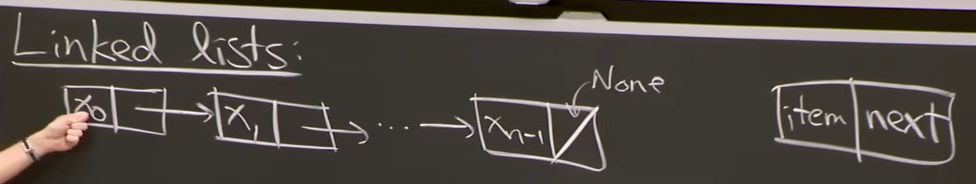
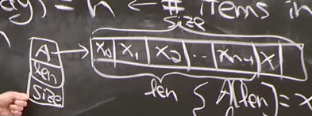
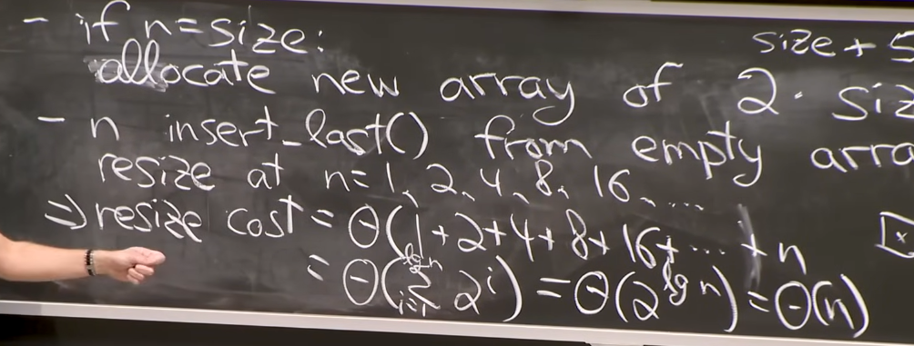
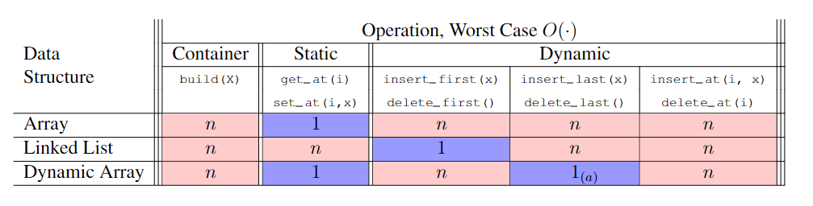

这是 MIT 6.006 算法导论课程的第二讲笔记，主要介绍了数据结构和接口的区别，以及静态数组、链表和动态数组在实现队列的时间复杂度分析。

<!--more-->

## Interface(API) vs. Data structure

### Interface

是一种规范 (specification)，关于储存什么数据、可以进行哪些操作，是 " 问题 "

这节关注两种主要的 API，set & sequence

### data structure

是一种表示 (representation)，关于如何储存数据、应该使用哪些算法去支持相应操作，是 " 答案 "

两种主要的 DS，arrays & pointered based

## Static sequence interface

build(x) - make new; len(); iter_seq() - 注意保持顺序；get_at(i); set_at(i); get_first/last; set_first/last

解决/DS：很自然的想到，静态数组 - **static array**

> array - 是一块连续的内存，那么访问 `array[i]` 时，就等价于访问 `memory[address(arrray)+i]`，这也就意味着可以以常数时间 get_at(i) 和 set_at(i)

O(1) - get_at(i); set_at(i); len()

O(n) - build; iter_seq;

memory allocation model: 创建大小为 n 数组的时间复杂度为 $\Theta(n)$；同时空间复杂度为 O(n)

## Synamic sequence interface

增加两个动态操作 insert_at(i, x) - 这意味着第 i 个位置之后的元素都需要进行偏移; delete_at(i); insert/delete_first/last()

> 可能在某些数据结构下，在首尾插入和删除可能是常数时间 - 虽然可能在 get_at(i) 无法实现常数

## Linked lists - DS

注意到，他们在实际内存中的顺序可能是任意的。

指针只是储存了下一个 item 的地址。

## Dyanamic sequence operation

### static array

insert/delete_at() - $\Theta(n)$ 时间： 偏移操作/shift；即使是开头和结尾的元素，也需要 shift，因为 static array 在内存分配的时候，只索取了固定大小 $n$ 的空间，其左右空间可能都已经占满了，当需要 n+1 时，不得不进行 shift 以找到一块 n+1 的空位置，然后复制，这就是 allocation/copying；

### linked list

> 与 静态数组几乎相反

insert/delete_first 是 $O(1)$ 时间 - 直接改变首项的指针；

get/set_at(i) 是 $\Theta(i)$ 时间，最坏就是 $\Theta(n)$，因为要一个一个指针从头找过去

如果想 get/insert_last 常数时间，只需要增加一个指向尾部的指针

## Dyanamic Arrays - Python's lists

放松数组大小正好等于 $n$ 的限制，而是设置为大概为 $n$；强制大小为 $\Theta(n)\geq n$ - 常数乘

仍然保持 `A[i]=x_i`，空白项在后面；insert_last 是常数的，只需要 `A[len]=x, len+=1`

同时 会储存数组的大小，注意这里 size(DS) - 分配的内存 和 len(interface) - 非空 item 的区别；当 size = len 就需要重新分配空间

重新分配空间在动态数组中 - 通常是 $2*size$，是偶尔的行为；在静态数组中则是每次添加都需要重新分配；

下图解释了为什么动态数组的分配是线性时间 $\Theta(n)$ 的（涉及到几何级数求和） - $O(1)$ amortized; 进而我们发现了 Amortization 的概念 - 把高成本分摊给其他低成本的操作，平均而言还是不错的 almost good

## 总结对比

## copy_forward VS. copy_backward

之所以有 forward 和 backward 的区分，在 python 中是因为类似 `A=self.A` 是引用，而不是直接的 copy。

引用，指的是二者指向同一块内存地址，而 copy 是需要申请一块新的并把原来的复制过去。

这种引用的特性，也就产生了可能 overlap 的问题。例如，把 `[1,2,3,4,5]` 从 index=1 开始移动一个位置 - **shift** right by one position，如果使用 copy_forward 则是从 index =1 开始，`A[2]=self.A[1]=2`，按照 forward 的算法，接下来是 `A[3]=self.A[2]` 但此时的 `self.A[2]` 已经被前一步的时候更改过，不是 3 而是 2，在以此类推进行 `A[4]=self.A[3]=2`，最后的结果为 `[1,2,2,2,2]` 而不是我们想要的 `[1,2,2,3,4]`。我们采用 backward，首先从 `A[4]=self.A[3]=4` 开始，第二步是 `A[3]=self.A[2]=3`，注意到主要的区别就在这里，第二步我们需要的 `self.A[2]` 并没有被第一步更改，故继续按照 backward 算法进行，`A[2]=self.A[1]=2`，最后的结果为 `[1,2,2,3,4]` 正如我们想要！

## Reference

https://ocw.mit.edu/courses/6-006-introduction-to-algorithms-spring-2020/

https://ocw.mit.edu/courses/6-006-introduction-to-algorithms-spring-2020/resources/mit6_006s20_lec2/
