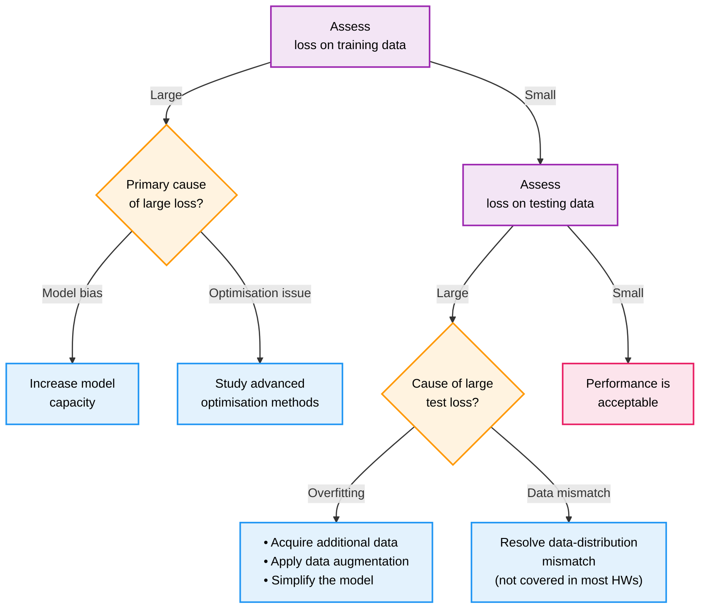

这是 Hylee 机器学习课程的第二讲，重点介绍机器学习模型优化的通用指导原则。本文将系统性地讲解如何通过分析训练误差和测试误差，识别模型问题的根本原因，并提供相应的解决策略来提升模型性能。

<!--more-->

## 概述

在机器学习项目中，理想情况下训练集误差和测试集误差都很小，这意味着模型成功地学习了数据中的模式并能够很好地泛化到新数据。然而，实际情况往往更加复杂，需要我们系统性地分析和解决各种问题。

本文用 " 训练误差→测试误差 " 两步排查流程，教初学者判断模型性能不佳的根本原因（模型偏差、优化问题、过拟合或数据分布不匹配），并给出针对性的改进策略。

## 机器学习模型诊断流程

## 训练集误差很大

当训练集的误差表现不好的时候，有两个方向可以考虑：模型偏误和优化问题。

模型偏误 (bias) 常见于模型容量不足，也就是模型的 capacity 不够，其提供的潜在解空间中根本不包含误差足够小的解。改进方法就是增加模型的 capacity，可以通过改用更复杂的方法、增加更多的 feature 等，重新设计拟合更强力的模型。

> 经典的偏差-方差权衡 (bias-variance trade-off)：模型容量不足，表达能力不足 - 高偏差，低方差；模型容量过大，过度学习噪声 - 低偏差，高方差，存在过拟合风险。

优化问题指的是，虽然我们设计的模型容量足够（即候选解空间中存在好的解），但优化算法未能成功找到它。在传统的机器学习中，一个常见担忧是算法陷入了**局部最小值（local minima）**。然而，在现代深度学习的高维参数空间中，研究表明局部最小值问题并不如想象中严重。更常见的挑战是优化过程陷入**鞍点（saddle points）**，在这些点上，梯度虽然为零，但它在某些维度上是局部最小值，在另一些维度上却是局部最大值，导致优化算法（尤其是基于一阶梯度的方法）难以逃逸，从而停滞不前。

从数学上说，鞍点就是参数对应 Hessian 矩阵的特征值有正也有负。Hessian 矩阵的特征值代表了参数在特征方向上移动对损失值的影响。如果其为正特征值，参数沿着对应特征向量方向移动，损失就会变大。如果一个点对应的 Hessian 矩阵所有的特征值都是正的，也就是在任何方向上移动都是增大损失，也就是局部最小值。全是负特征值，同理可以得到局部最大值。鞍点就是，既有正特征值，也有负特征值，从另一个角度上来看，就是对于某些维度是局部最小值，对于另一些维度则是局部最大值。

如何判断到底问题的类型？可以先从简单模型开始，逐步提高复杂度。建立一个简单的基线模型（如 Logistic Regression 或一个浅层神经网络），其训练误差可以作为判断更复杂模型是否"优化充分"的锚点。如果你的复杂模型训练误差还不如简单模型，那几乎肯定是优化问题。

我们可以从较小、参数设置较简单、容易收敛的基础模型入手，在得到训练误差的基准之后，逐步增加模型的复杂度，同时调整优化算法的各种设置。

在观察训练过程中，更进阶的方式是观察训练过程中的**梯度范数**(检查梯度流)。很多框架都提供函数，可以在训练迭代的过程中，导出并可视化梯度范数随着训练轮次增加的变化，我们也可以观察这一曲线来了解模型的收敛情况。理想的曲线应该是：刚开始梯度范数较大，但逐渐变小，这证明模型在逐渐收敛。如果观察到曲线忽然增大甚至出现 inf 或者 nan，这通常是梯度爆炸的信号。反之，如果曲线在训练初期就迅速衰减到接近 0 的水平并停滞不前，这可能是发生了梯度消失。

> 为什么是梯度**范数**？对于一个损失函数，它可能有大量的参数，其对应梯度**向量**就有很多维度，范数正是把这个多维度的向量压缩成一个数字，同时尽可能保留更多的信息，梯度向量范数就可以视为梯度的整体大小或者强度。通常默认为二范数 $\|\mathbf{v}\|_2 = \sqrt{v_1^2 + v_2^2 + \dots + v_n^2}$，可以理解为向量的"空间长度"，对于 1,000,000 维度的梯度向量则有 $\|\nabla L(\theta)\|_2 = \sqrt{ \left(\frac{\partial L}{\partial \theta_1}\right)^2 + \left(\frac{\partial L}{\partial \theta_2}\right)^2 + \dots + \left(\frac{\partial L}{\partial \theta_{1,000,000}}\right)^2 }$。

## 测试集误差很大

当训练集的误差表现还算不错的时候，我们才开始观察测试误差。测试误差表现较差，同样可能来自两大问题，过拟合和数据分布不匹配。

判定过拟合的标准是，训练误差很低，但是在没见过的测试集上的表现很差。可以形象地理解为，模型记住了训练集的数据，甚至连其中的误差都完全记住了，在没见过的测试集数据上，就是随便猜测结果，自然误差很大。

> 测试误差与训练误差多大算大？1%-2% 的差距是可以接受的，10% 以上的差距就说明问题在于过拟合或者数据不匹配。

如何抑制过拟合，主要可以分为两大方向的方法：直接降低模型复杂度、正则化。

直接降低复杂度，通过更改模型架构来**限制**模型的潜在学习能力，使其无法轻易地记住噪声。经典的方法有：减少参数、参数共享、减少特征等。它们本质上是**直接、硬**改变潜在的模型假设空间，让其能够表达的函数集合变小。

正则化的方法还可以细分为显式正则化和隐式正则化。这些方法并不改变模型的假设空间，但利用特定的手段以一定的偏好，去**引导**优化算法在庞大的空间中求解。

显式正则化就是明确地在损失函数之后加上一个惩罚项，惩罚过大的模型权重。例如，L1 惩罚项会倾向于稀疏权重，L2 惩罚项 (weight decay) 会倾向让所有权重都比较小。还有其他更多形式的惩罚项。

> 一个经典的例子是卷积神经网络（CNN）与全连接网络（FNN）的对比。对于图像任务，FNN 拥有极高的弹性（或称容量），每个像素都与下一层的每个神经元连接，参数量巨大，非常容易过拟合。而 CNN 通过**参数共享**（在整个图片上使用同一个卷积核）和**局部连接**（神经元只响应局部区域），极大地降低了模型的有效容量，使其成为一个更"低弹性"但对图像任务更有效的模型。

隐式正则化则是利用一些其他技巧，达到了同样正则化的效果但不是直接在损失函数上添加惩罚项。比如，Early Stopping、Dropout、数据增强、批量归一化等。

分布不匹配本质上是数据问题，而非训练问题。我们将在训练数据集上得到的模型用在测试数据集上，其潜在前提是测试数据和训练数据来自同一分布，而不是来自不同分布。

课堂上的例子是新冠数据的死亡人数预测。假设我们用 2020 年的数据进行训练，而想要在 2021 年的数据上进行预测和验证，那么无论我们如何在训练集上努力，测试集上的结果都不会太好。因为从数据分布上来讲，2020 年和 2021 年是完全不一样的。这个问题的解决，通常要更新数据集，或者利用领域自适应技术让测试与训练分布更加接近。
