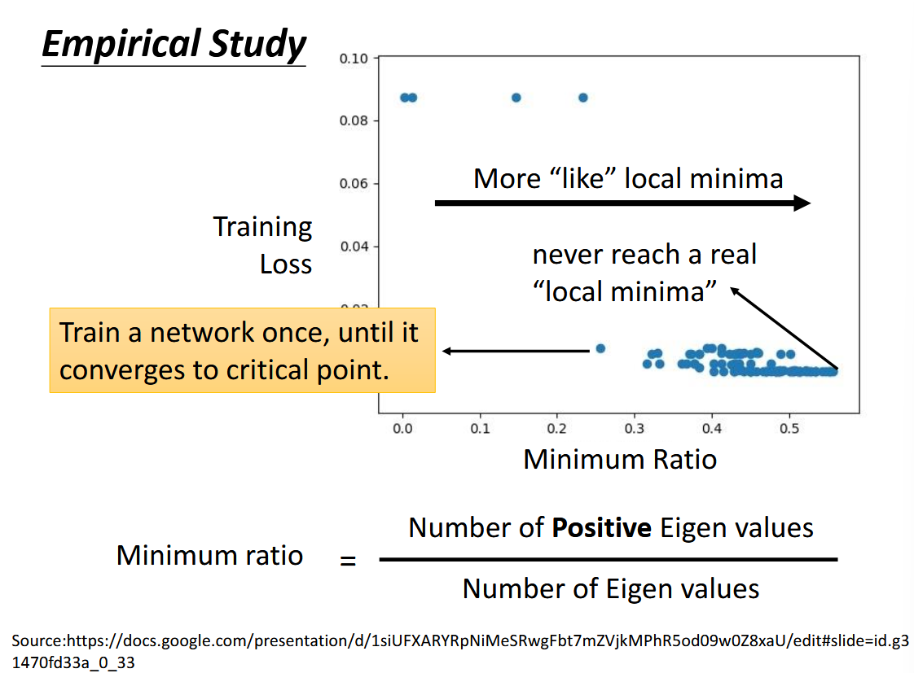
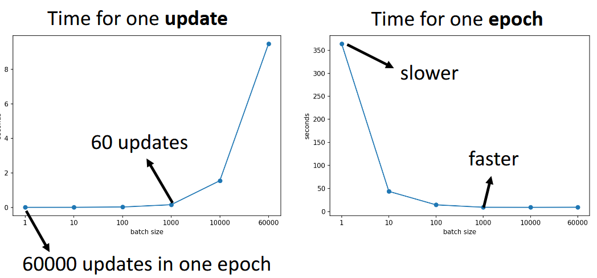
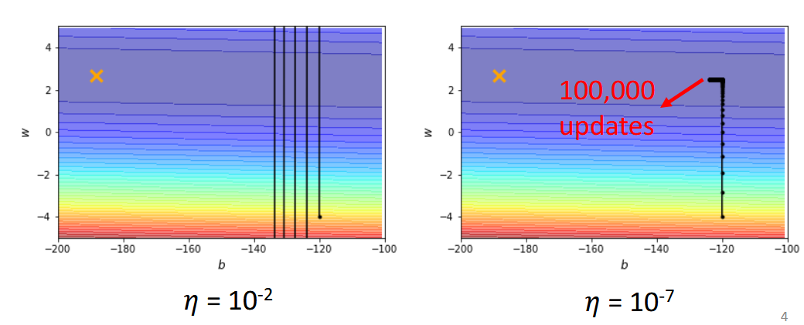
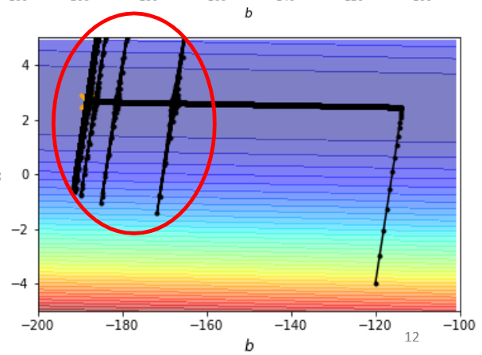

这篇博文总结了李宏毅机器学习课程中关于训练优化的核心技巧，解释了当损失不再下降时可能遇到的鞍点问题、批次大小（Batch）和动量（Momentum）的作用，并详细阐述了从 AdaGrad 到 AdamW 等自适应学习率方法的发展脉络。

<!--more-->

这是这个系列的第三篇博客，主要包含视频 [^1] 的汇总和自我扩展。

## 训练停滞的数学分析：Critical Point 问题

### 重新认识 Local Minimum 和 Saddle Point

> [^2]

当我们训练模型的时候，很容易观察到 loss 不再下降，这意味着我们的模型训练遇到了一些问题。通常会听说，这是因为 gradient descent 的弊端，因为它很容易卡在 local minima 而无法找到更优的参数。

但其实这种说法十分地外行。首先，优化不止可能卡在 local minima，而是可能卡在任何梯度为 0 的地方，除了 local minima，还有 saddle point - 鞍点。我们把优化过程中任何梯度为 0 的点都叫作 critical point。其次，在后面会有实验证明，卡在 local minima 的可能性远小于卡在 saddle point；我们在实践中观察到的 loss 无法继续下降的原因，很大可能不是 critical point，而是不合适的 learning rate 带来的结果。

### 数学推导：如何区分 Saddle Point 和 Local Minima

当梯度真的到达 0 的时候，也不是完全没有办法。如果是 saddle point，还是有办法**逃离**的。我们首先要想办法区分 saddle point 和 local minima。

当损失函数 $L(\theta)$ 在 $\theta=\theta'$ 时，我们可以通过泰勒公式在点 $\theta'$ 进行展开

$$
L(\theta) \approx L(\theta')+(\theta-\theta')^Tg + \frac{1}{2}(\theta-\theta')^TH(\theta-\theta')
$$

其中，$g$ 为梯度向量，还写作 $\nabla L(\theta')$, $g_{i}=\frac{ \partial L(\theta') }{ \partial \theta_{i} }$; $H$ 是 Hessian 矩阵，$H_{ij}=\frac{ \partial^{2} }{ \partial \theta_{i} \partial\theta_{j}}L(\theta')$

当到达 critical point 的时候，$g=0$, $L(\theta) \approx L(\theta') + \frac{1}{2}(\theta-\theta')H(\theta-\theta')$，可以看出点 $\theta'$ 的情况取决于 $(\theta-\theta')H(\theta-\theta')$ 的正负符号。

不妨令 $(\theta-\theta')H(\theta-\theta')=v^THv$，对于所有的 $v$

- $v^THv>0$，那么 $L(\theta)>L(\theta')$，故 $\theta'$ 为 local minima
- $v^THv<0$，那么 $L(\theta)<L(\theta')$，故 $\theta'$ 为 local maxima
- $v^THv$ 有正也有负，那么 $\theta'$ 为 saddle point

在计算中，我们无需算出所有 $v$ 的对应情况，只需要计算 Hessian 矩阵的对应特征值和特征向量。令 $\mathbf{u}$ 为 Hessian 矩阵 $H$ 的一个特征向量，其对应的特征值为 $\lambda$。当我们将参数点 $\theta'$ 沿着 $\mathbf{u}$ 的方向移动一个微小的步长 $\alpha$ 时，即令 $\theta - \theta' = \alpha \mathbf{u}$，损失函数的变化为：

$$
L(\theta) - L(\theta') \approx \frac{1}{2}(\alpha \mathbf{u})^T H (\alpha \mathbf{u}) = \frac{1}{2}\alpha^2 \mathbf{u}^T H \mathbf{u}
$$

利用特征向量的性质 $H\mathbf{u} = \lambda\mathbf{u}$，上式可化为：

$$
L(\theta) - L(\theta') \approx \frac{1}{2}\alpha^2 \mathbf{u}^T (\lambda\mathbf{u}) = \frac{1}{2}\alpha^2 \lambda (\mathbf{u}^T\mathbf{u}) = \frac{1}{2}\alpha^2 \lambda \lVert \mathbf{u} \rVert^2
$$

因此，当特征值 $\lambda < 0$ 时，$L(\theta) < L(\theta')$。这意味着，只要我们沿着 Hessian 矩阵负特征值对应的特征向量方向更新参数，就能够找到一个使损失函数下降的方向，从而逃离鞍点。

> $\mu^{2}$ 是逐个元素的平方，而 $\lVert\mu\rVert^{2}$ 是范数的平方
>

> PPT[^2] 上有个实际计算的简单示例，演示了具体计算过程。

### 高维空间中的直观理解

从 Hessian 的特征值角度来说，局部最小值要求所有特征值都为正数，即按照任何一个特征向量对应方向都会带来损失上升。而对于维度极高的损失函数，其 Hessian 特征值更多情况为有正有负，可以看作在某些维度是局部最大值，在某些维度是局部最小值，这就是鞍点。

从感性角度理解，local minima 是要求当前点对于周围任何方向都最小，当我们的参数空间足够大，error surface 的维度足够高的时候，**local minima 是很难出现的**。下图更是从实验上证明，最坏的情况也有一半的特征值是负的，也就是有一半的方向，是可以让参数走过去以降低 loss 的。

如果你真的认为训练是因为 critical point 卡住，那也是卡在了 saddle point，然后就可以美滋滋地逃离。实践中因为 Hessian 矩阵及特征值特征向量计算复杂，通常采用 Adam 等自适应方法。

## 批次大小优化：Batch Size 的权衡艺术

### Batch Size 的基本概念与计算流程

batch 的主要思路，就是把 train data 分块，每次参数更新只考虑一个 batch，而不是全部的 train data，当我们遍历了全部的 batch，也就是更新参数 $\frac{\text{train data size}}{\text{batch size}}$ 次之后，叫作一个 epoch。通常我们会 shuffle - 重新把 batch 分组，而后继续下一个 epoch。

让我们想象两个极端情况，$\text{batch size}=n$ 和 $\text{batch size=1}$ ，即 model 每次看到全部的数据再更新参数以及看到一个样本就着急地更新参数。对于前者，他需要看到所有样本，所以每个 batch 的计算时间比较长，一个 epoch 只需要更新一次参数；对于后者，他每次看到一个样本就更新一次参数，每个 batch 的计算时间较短，但一个 epoch 需要更新更多次参数。可以理解为，当 batch 较大的时候，它可以看到更多的数据，每次更新参数都比较精准；当 batch size 比较小的时候，更新的步伐看起来比较有噪声。

从直觉上，我们会认为当 batch size 比较大的时候，由于数据更多，计算 gradient 的数据量更大，计算 gradient 的时间会很长，但实际上，由于我们可以利用 GPU 提供的并行计算 - parallel computing，同时计算许多 gradient，而不是直觉上的一个接着一个。在计算 gradient 中，batch size 从 1 到 1000，参与训练数据量的变动对于每次更新 - every update 的影响是可以忽略不计的，除非 batch size 达到突破了 GPU 限制。

> 每见过一个 batch，然后更新参数 - update；见过所有 batch，即见过全部训练数据 - epoch

batch size 越小，需要进行的 update 和其他操作就更多，每个 epoch 所需要的时间就越多。一次 update 所需时间 vs batch size 与 一次 epoch 所需时间 vs batch size 是相反方向的关系，所以 batch size 的大小是个关于 trade-off 的超参数。具体细节见摘自 PPT[^2] 的下图：

### Small Batch Size 的优化优势

从实际训练中来看，batch size 越小，在 train 和 validation 上表现越好。这是因为，小 batch size 会对应更多的 loss function，不同的 error surface 可能对应不同的 critical point， 这就很难在训练中卡在某个 critical point，同时 small batch 中的 noisy 在验证和测试的过程中会提高模型的泛化能力，从而在全方位获得更好的表现。

更理论地说，small batch 的梯度可以看作是真实梯度的一个无偏估计，只是其方差较大。这种 " 噪声 " 可以帮助优化过程 " 跳出 " 损失函数中尖锐的局部最小值（sharp minima），并倾向于收敛到更平坦的最小值（flat minima）。收敛到平坦的最小值通常能获得更好的泛化能力。因为测试集的数据分布与训练集略有不同，参数的微小扰动不会导致损失大幅增加。Small batch 训练天然地倾向于寻找这种平坦区域。

> small batch size 可以帮助逃离 critical point

完全相同的模型，采用不同的 batch size，把 full 和 small 在训练集上的表现 train 到同样好，测试时发现，small batch size 的结果会更好。

> 实践中会更加复杂，在调整 batch size 的同时，需要对应比例调整 learning rate [^3]。

最后用来自 PPT 上的对比表格进行总结

|                                      | Small       | Large                |
| ------------------------------------ | ----------- | -------------------- |
| Speed for one update (no parallel)   | Faster      | Slower               |
| Speed for one update (with parallel) | Same        | Same(not too large)  |
| Time for one epoch                   | Slower      | **Faster**           |
| Gradient                             | Noisy       | Stable               |
| Optimization                         | **Better**  | Worse                |
| Generalization                       | **Better**  | Worse                |

> 注：batch size 不是越小越好，噪声太大，也可能让模型无法真正利用训练数据，反而损害泛化效果

当然，大 batch size 并不是一无是处，它能更大程度加快训练速度，在优化得当的情况下，是可以获得与较小 batch size 相同的泛化能力和测试结果，同时又可以节省 CPU/GPU 资源，节约时间。

批次大小优化虽然能在一定程度上帮助逃离局部最优，但当训练依然停滞时，我们需要考虑更强大的优化技巧——动量方法。

## 动量优化：借鉴物理学的 Momentum 方法

### 动量的物理直观与数学实现

momentum - 动量是解决优化问题的另一个技巧，借鉴了物理中的思路，当一个球体从陡峭高处向下滑动时，即使遇到了局部低点，仍然也会有力尝试把球体带离低点。传统的梯度下降就好像不断地找更低的方向让球从高处滚下，当梯度为 0 时，就好像球滚到了低谷，利用动量的思想，给出综合梯度下降之前的移动方向，即使梯度为 0 时也可以给出一个新的方向，以逃离低点。

传统的梯度下降，就是从 $\theta^{0}$ 开始，计算 $g^{0}$，更新 $\theta^{1}=\theta^{0}- \eta g^{0}$；继续计算 $g^{1}$，更新 $\theta^{2}=\theta^{1}-\eta g^{1}$。

考虑动量，是在传统梯度下降的基础上，额外考虑前一步的移动方向。具体来说，参数更新分为两步：计算动量与更新参数。

**计算动量更新量 $m^t$：** $m^t$ 是上一步的动量 $m^{t-1}$ 和当前梯度 $g^t$ 的加权和。

$$
m^{t} = \lambda m^{t-1} - \eta g^{t}
$$

 其中 $\lambda$ 是动量系数（通常接近 1，如 0.9），$\eta$ 是学习率。初始动量 $m^0=0$。

**更新参数 $\theta^t$：**

$$
 \theta^{t+1} = \theta^{t} + m^{t}
$$

 通过展开这个递推式，我们可以看到 $m^t$ 是过去所有梯度的指数衰减加权和：$m^1 = -\eta g^0$,$m^2 = \lambda m^1 - \eta g^1 = -\lambda \eta g^0 - \eta g^1$, $m^t = -\eta \sum_{i=0}^{t-1} \lambda^{t-1-i} g^i$。因此，Movement $m^t$ 是之前所有梯度 $g^0, \dots, g^{t-1}$ 的加权和，越近的梯度权重越高。

另一种更加常见的表达方式是首先计算速度向量 (velocity)，$v^t=\beta v^{t-1}+ (1-\beta)g^t$，然后利用其更新参数 $\theta^{t+1}=\theta^t-\eta v^t$。

## 自适应学习率：从 AdaGrad 到 AdamW 的演进

### 学习率问题的本质诊断

当我们发现 train loss 卡住不再下降的时候，我们会联想到梯度为 0 和 critical point，可如果我们仔细审查一下此时的梯度，会惊奇地发现，梯度不但显著不为零，甚至还会有所波动。可能此时，我们的参数正在局部最小值左右疯狂震荡，却无法接近；可能正在小步奔向局部最小值而永远无法达到。这是我们即将要讨论的学习率 - learning rate 的问题。

学习率决定了在确定梯度下降的方向之后，我们的参数更新迈出多大步伐。如果过大，可能会从一个高 loss 走向令一个高 loss，如果过小，可能在梯度同样很小的时候，怎么也走不到终点。可以参考摘自 PPT[^4] 中的示例图。

不同的参数需要不同的学习率。从直观上可以想象，两个变量的天然尺度就不同，某些参数的梯度天然很大，而某些天然很小，如果将二者设置为完全相同的学习率，就会导致大的那个不断震荡，而小的几乎不收敛。

> 关于为什么不同参数需要不同学习率，可以解释的方向还有很多。

当我们考虑参数 $\theta_{i}$ 的更新 $\theta_{i}^{t+1} = \theta^t_{i}-\eta g_{i}^{t}$，其中 $g_{i}^{t}=\frac{ \partial L }{ \partial \theta_{i} }|_{\theta=\theta^t}$，可以考虑添加 parameter dependent 项，更新参数通过

$$
\theta_{i}^{t+1} = \theta^t_{i}-\frac{\eta}{\sigma_{i}^{t}} g_{i}^{t}
$$

### AdaGrad：Root Mean Square 的开创性思路

关于 $\sigma_{i}^{t}$ 的具体计算方法，Root Mean Square 是一种经典思路。 $\theta^{1}=\theta^0-\frac{\eta}{\sigma^0}g^0$, $\sigma^0 = \sqrt{ (g^0)^{2} }=\lvert g^0 \rvert$; $\theta^2=\theta^1-\frac{\eta}{\sigma^1}g^1$,$\sigma^{1}=\sqrt{ \frac{1}{2} [(g^0)^{2}+(g^1)^{2}] }$，更一般

$$
\theta^{t+1}=\theta^t-\frac{\eta}{\sigma^{t}}g^t, \sigma^t=\sqrt{ \frac{1}{t+1} [(g^0)^{2} + (g^1)^{2}+\dots+(g^t)^{2}] }=\sqrt{ \frac{1}{t+1} \sum_{i=0}^{t}(g^i)^{2} }
$$

> 省略为了区分单个参数 $i$ 的下标，参数 $\theta_{i}^{t}$ 简化为 $\theta^{t}$
>

> 经典的 AdaGrad 形式上没有 $\frac{1}{t+1}$ 这个因子平衡，而仅仅是过往梯度的平方和累加。所以，其最主要的问题其实是 $\theta$ 更新的分母单调递增。

可以看到，$\sigma^t$ 与过往梯度 $g$ 在大小上成正比，那么 $\frac{\eta}{\sigma^t}$ 就与过往梯度成反比，即当过往梯度较大的时候，调整小一点的 lr，当过往梯度较小的时候，调整大一点的 lr。这个思路，就是经典的 AdaGrad。

### RMSProp：解决 AdaGrad 的累积问题

AdaGrad 有个问题，就是它将过往的所有梯度都纳入考量并给予相同权重，这是不太合理的。因为我们可能已经从梯度大走向梯度小，而 lr 的调整系数还在考虑过往的巨大梯度而不能及时缩小 lr。

所以，后来提出了 RMSProp，作为目前被广泛使用的基础组件。同样利用 $\theta_{i}^{t+1} = \theta^t_{i}-\frac{\eta}{\sigma_{i}^{t}} g_{i}^{t}$ 更新参数，只不过

$$
\sigma^t = \sqrt{ \alpha(\sigma^{t-1})^{2}+(1-\alpha)(g^t)^{2} }
$$

其中 $0<\alpha<1$，通常对最近的梯度 $g^t$ 赋予较大参数，对过往梯度 $\sigma^{t-1}$ 使用较小权重。因为放大了最近梯度的权重，所以 RSMProp 的反应速度要快上许多，对于较小梯度可以较快的加大 lr，对较大梯度同理。**实践中经常使用的 Adam 就是 RMSProp + Momentum。**

$$
\begin{aligned}
m_t &= \beta_1 m_{t-1} + (1-\beta_1) g_t && \text{-- (1) 动量项：梯度的指数移动平均（一阶矩）} \\
v_t &= \beta_2 v_{t-1} + (1-\beta_2) g_t^2 && \text{-- (2) RMSProp项：梯度平方的指数移动平均（二阶矩）}\\
\hat{m}_t &= \frac{m_t}{1-\beta_1^t} && \text{-- (3) 偏差修正（解决初始阶段的冷启动问题）}\\
\hat{v}_t &= \frac{v_t}{1-\beta_2^t} && \text{-- (4) 偏差修正}\\
\theta_{t+1} &= \theta_t - \eta \frac{\hat{m}_t}{\sqrt{\hat{v}_t} + \epsilon} && \text{-- (5) 最终更新}
\end{aligned}
$$

> 注意 " 偏差修正 " 部分。这种修正适用于任何指数平均 (EMA) $S_{t}=\beta S_{t-1}+(1-\beta)x_{t}$ 来估计一个从零 ($S_{0}=0$ 或者其他 " 冷启动 " 指定初始值，而不是实际的初始状态) 开始的信号场景。
>
> 稍作整理可以得到 $S_{t}=(1-\beta)\sum_{i=1}^{t}\beta^{t-i}x_{i}$。我们希望 $S_{t}$ 是对原始状态真实期望 $E(x_{t})$ 的无偏估计。假设所有的 $x$ 来自同一分布，同期望 $E(x_{i})=E(x)$，$E(S_{t})=(1-\beta)\sum_{i=1}^{t}\beta^{t-i}E(x_{i})=E(x)(1-\beta)\sum_{i=1}^{t}\beta^{t-i}$。这是个等比数列，其数列和进一步可以简化为 $E(S_{t})=E(x)(1-\beta) \frac{{1-\beta^t}}{1-\beta}=E(x)(1-\beta^t)$。那么 $\hat{S}_{t}=\frac{S_{t}}{1-\beta^t}$ 就是一个对 $E(x)$ 的无偏估计。
>

> 这种修正，是为了修正在 $t$ 比较小的时的估计精度。

要注意，RMSProp 解决的是 **" 各参数维度（per-parameter）步长如何因梯度大小不同而自动缩放 "** ，让大梯度对应维度补步长变小，小梯度对应维度步长变大。但它并没有解决，**" 整条训练曲线在时间维度上该走多快、何时减速 "**，RMSProp 只是提供基于绝对步长 $\eta$ 的相对步长 $\frac{\eta}{\sigma^{t}}$，如何规划绝对步长随训练过程的变化，这是 learning rate schedule 的课题。

通常在训练前期，我们可能需要比较大的 lr 以快速降低 loss，而在快要结束的时候，error surface 接近平坦，需要较小的 lr 来寻找局部最小。这就需要我们根据训练的不同时期，对学习率进行整体上的大小调节。

下图^[3] 演示了只使用 AdaGrad 可能产生的问题。在训练初期纵轴方向梯度较大的时候，步长较小，逐渐找到了梯度较小的区域，开始向左边的最优点进行移动。此时纵轴方向的梯度变小，$\sigma^t$ 是过去所有梯度的加权，慢慢也随之变小，不断积累之后导致 $\frac{\eta}{\sigma^t}$ 变大，会向纵轴方向大步前进。好在还可以修正，因为向纵轴向前进很快就遇到了梯度较大的地方，$\sigma^t$ 随之变大，$\frac{\eta}{\sigma^t}$ 随之变小，训练曲线又回到了原来的路径。这个过程可能会循环几次，然后慢慢走到终点。

对于上述这种情况，我们只需要设置 learning rate decay，让 learning rate 随着训练进行不断减小即可解决。

learning rate 随着时间变化，有很多种方式。另一种十分常见的方式，就是 warm up。在开始的阶段使用小一点的 lr 然后不断升高，在某个时刻之后再下降，其中，变到多大、速度如何都是超参数。对于 warm up 的必要性，感性的解释就是，由于我们需要计算 $\sigma$，而 $\sigma$ 的计算需要很多数据加权，所以一开始先设置小一点的 lr，帮助搜集足够的数据来形成合适的 $\sigma$，等其比较准确之后，再慢慢爬升学习率。

> 还有诸如余弦衰减等方式

## 方案演进

训练停滞？

梯度并未消失，但损失在震荡：自学习率的设置 -> 自适应学习率

自适应学习率之后，训练依然停滞： 可能被困在鞍点 -> 利用动量，根据历史梯度向前冲；小批量训练改变误差曲面帮助逃逸

## AdamW：优化器的现代解决方案

### 理解 L2 正则化与权重衰减的区别

在讨论 AdamW 对于 Adam 所做的改进之前，让我们详细地再说明一下 L2 正则化。对于常规情况，L2 正则化就是在常规损失函数上添加一个与权重范数平方成正比的惩罚项 $L'=L_{original}+\frac{\lambda}{2}\sum_{i}\theta_{i}^{2}$ ，其中 $\lambda$ 为权重衰减系数。从结果上看，这会在考虑损失的情况下，抑制过大参数的产生，让各个参数的权重尽可能地均衡。

> 在传统的梯度下降（SGD）中，将 L2 正则化项加入损失函数，其梯度效果等价于在每次参数更新时，将权重按一个固定的比例向零缩减，这便是 ' 权重衰减 ' 这个名字的由来。然而，我们将看到，在 Adam 这样的自适应优化器中，这种等价性被打破了，这也是 AdamW 提出的核心动机。

这样的设计基于一些教材没有显著提及的重要先验假设：一个好的模型不应该有绝对值特别大的权重；一个好的模型应该将预测的权重尽可能分散到多个特征上，而不是依赖单一的 " 英雄 " 特征。如果某个 feature 对应权重巨大，模型结果就会受到这个 feature 略微波动的重大影响，这一点也不 robust；反之如果各个 feature 对于模型结果的影响力都差不多且微弱，整个模型会更加稳定。

回到 Adam，如果按照标准方式添加 weight decay/L2 regulation，再计算梯度，根据链式法则，L2 项会对整个梯度产生影响，

$$
\begin{align}
g'_t & = \nabla L_{total}(\theta_t) = \nabla L_{original}(\theta_t) + \lambda \theta_t = g_t + \lambda \theta_t \\
m_{t} & = \beta_{1}m_{t-1}+(1-\beta_{1})(g_{t}+\lambda\theta_{t}) \\
v_{t} & = \beta_{2}v_{t-1}+(1-\beta_{2})(g_{t}+\lambda\theta_{t})^{2}
\end{align}
$$

进而对 Adam 的动量 $m_{t}$(梯度方向) 和 $v_{t}$(自适应学习率的缩放因子) 产生影响。对于大权重，标准 Adam 不仅通过梯度项进行衰减，还通过减小其学习率 (由于 $\lambda\theta_{t}$ 较大，$v_{t}$ 变大，进而自适应学习率变小) 来 " 惩罚 " 它。

此时，对于那些历史梯度较大的权重（通常也是绝对值较大的权重），Adam 会自适应地减小其有效学习率（因为 $v_{t}$ 较大），这会**削弱**权重衰减项的效果。相反，对于历史梯度较小的权重，其有效学习率受到的抑制较少，因此权重衰减能更有效地发挥作用。这导致**权重衰减的效果与权重的大小不成正比**。权重衰减的效果，不光由 $\lambda$ 控制，更重要的是通过 $v_{t}$ 难以控制。观察这个参数更新过程，优化动态 (梯度计算) 与正则化 ($\lambda$ 影响的对于大权重的惩罚) 互相干扰。

而 AdamW 就是从此着眼，把 $\lambda\theta_{t}$ 从损失函数中剥离，而直接在参数更新 $\theta_{t+1}$ 中进行。梯度 $g_{t}$、一阶矩 $m_{t}$ 与二阶矩 $v_{t}$ 都按照经典 Adam 进行计算，得到更新量 $\text{Adam update}=\eta  \frac{{\hat{m}_{t}}}{\sqrt{ \hat{v}_{t} }+\epsilon}$。更新参数时 $\theta_{t+1}=\theta-(\text{Adam update}+\eta\lambda\theta_{t})$ 。此时，当我们衡量权重衰减效果的时候，只需要关注 $\eta\lambda\theta_{t}$ ，这只与全局基准学习率 $\eta$ 与衰减系数 $\lambda$ 和自身大小 $\theta_{t}$ 有关，而与历史梯度等无关。

这就实现了优化过程和正则化的**解耦（decoupling）**。优化器（Adam 的核心部分）专注于根据梯度信息寻找损失函数的最小值，而正则化器（解耦的权重衰减项）则作为一个独立的机制，稳定地对过大的权重进行惩罚。AdamW 让权重衰减恢复了它在 SGD 中的原始含义：**与梯度历史无关，以一个可预测的、与学习率成比例的速率，将所有权重推向零。**

## 总结

我们从原始的梯度下降，进化到了一个更复杂的范式：更新量 = 全局学习率 × (动量项 / 历史梯度调整项)。在 Adam 中，这具体表现为：

$$
\theta_{t+1} = \theta_t - \eta_t \frac{\hat{m}_t}{\sqrt{\hat{v}_t} + \epsilon}
$$

其中，$\hat{m}_t$ 作为动量项，为更新提供了主要的方向和动力；而分母 $\sqrt{\hat{v}_t}$ 则根据每个参数的历史梯度大小，对步长进行自适应的缩放。

> 动量项决定方向，RMS 项调整步长

在实践中，使用 Adam + learning schedule 技术即可实现。各种不同的方法，不过是在变化 $m_{i}^t$，$\eta_{i}^t$，和 $\eta_{t}$ 的计算方式。

在优化器的选择中，我们通常会首选 Adam 或者 AdamW，因为它结合了多种优点且对超参数相对不敏感。但是优化器的选择，仅仅是故事的一半，一个合适的学习率调度器（CosineAnnealingLR 等）同样很重要。

## Reference

[^1]: [When Gradient Is Small: Local Minimum and Saddle Point](https://www.youtube.com/watch?v=QW6uINn7uGk), [Tips for Training: Batch and Momentum](https://www.youtube.com/watch?v=zzbr1h9sF54), [Tips for Training: Adaptive Learning Rate](https://www.youtube.com/watch?v=HYUXEeh3kwY)
[^2]: <https://speech.ee.ntu.edu.tw/~hylee/ml/ml2021-course-data/small-gradient-v7.pdf>
[^3]: <https://stackoverflow.com/a/53046624>
[^4]: <https://speech.ee.ntu.edu.tw/~hylee/ml/ml2021-course-data/optimizer_v4.pdf>
