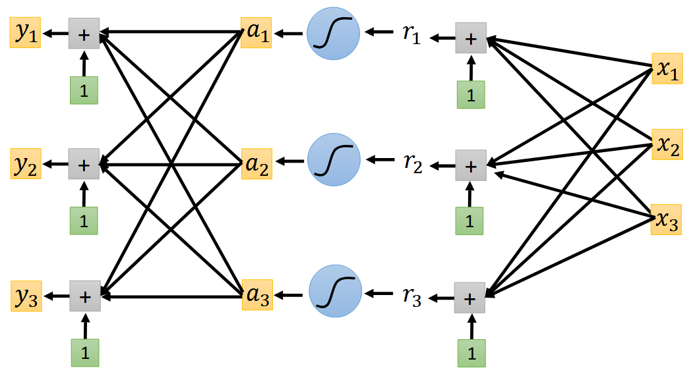
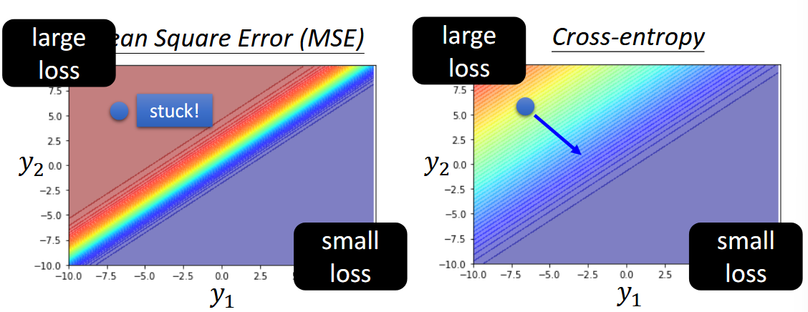
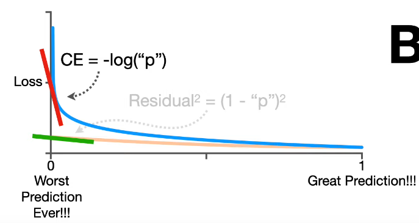

这篇博文解释了在多分类任务中，为何要使用 one-hot 编码处理标签、Softmax 函数处理模型输出，以及交叉熵损失函数（而非均方误差）来衡量预测与真实值之间的差距，从而构建一个高效且易于优化的神经网络模型。

<!--more-->

在分类任务中，简单地把类别编号为 1、2、3 会暗含距离和顺序偏差。为避免这一问题，我们首先使用 one-hot 向量对离散标签做无序编码。随后，网络输出层通过 softmax 将 logits 映射为 0-1 之间且和为 1 的概率分布；真正的 one-hot 只是标签而非模型输出。为了衡量输出概率与真实标签的差距，交叉熵损失因其在"错误但自信"的区域梯度更大，相比均方误差（MSE）更易于优化。本文结合公式推导与误差面可视化，说明从编码、输出到损失函数的完整链条如何共同提升分类模型的训练效率与性能。整体框架和思路主要借鉴李宏毅老师的课程内容。

## One-Hot 向量编码

One-hot vector 最主要解决的是分类变量不需要排序的问题。假设我们有三个分类变量，分别赋值为 1、2、3。此时，对于模型输出来说，类别 1 相比类别 3 更接近类别 2，这实际上引入了排序和距离。这种情况在实际问题中，是不一定成立的。

将分类变量变为 one-hot 向量，对于参数矩阵和梯度计算也很方便。

但要注意，不是所有的分类变量都需要严格变成 one-hot。首先，如果它们真的是有序的，或者它们只是标识符而不参与计算和输出，或者在类别极其多的时候，one-hot 会特别稀疏。

解决了标签编码问题后，接下来需要考虑如何让神经网络输出有意义的概率分布。

## 从 Logits 到 Softmax 概率分布

### 什么是 Logits

Logits 在当前语境下，指的就是未经 Softmax 的模型原始输出，可以理解为模型输出的、未经概率化的、代表每个类别对应可能性的原始分数。再向前追溯，它来自 logistic 函数。对于一个胜率 $p$，我们定义赔率 odds $\frac{p}{1-p}$ 来表示发生与不发生之间的概率之比。但观察可以发现，odds 的取值范围在 $[0, +\infty]$，是不对称的。为了解决这个问题，统计学家发明了 logistic 函数：$$\text{logit}(p) = \ln(\text{Odds}) = \ln \frac{p}{1-p}$$这就把输入概率 $p \in (0,1)$ 映射到了整个区间 $(-\infty, +\infty)$。Sigmoid 函数 $$\text{Sigmoid}(x) = \frac{1}{1 + e^{-x}}$$ 就是 logistic 函数的反函数，把整个实数域的值映射回 $(0,1)$。

在多分类中，Softmax 可以看作是 Sigmoid 的多维化。输入到 Softmax 函数之前的那个原始数值向量，其每个元素也都被类比地称为 **logit**。它代表了模型为每个类别估计的“对数赔率”式的信息，只不过是在一个多类别的、相对的尺度上。

### Softmax 函数原理

在计算中，假设我们的单个输入样本为一个包含三个特征的向量 $\mathbf{x} = [x_1, x_2, x_3]^T$，想要输出结果为 3×1 的 one-hot vector，计算过程与常规神经网络无异，只是输出为 3x1 的向量，其中 $y_i$ 代表可能是类别 $i$。具体架构见下图：

在回归中，我们有 $y = b + c^T\sigma(\mathbf{b} + W\mathbf{x})$，其中 $\sigma$ 为激活函数，常为 Sigmoid 或者 ReLU。在分类问题中类似，同样 $\mathbf{y} = \mathbf{b'} + W'\sigma(\mathbf{b} + W\mathbf{x})$ 得到一个其分量可能为任意数值的向量。Softmax 会把任意实数向量映射到 (0, 1) 区间，并保证所有分量之和为 1，因而可视为“类别概率分布”。

> 注意真正的 one-hot 只是标签形式，模型输出通常是接近 one-hot 的概率向量。

我们再衡量模型输出的 $\mathbf{y'}$ 与其对应标签 $\hat{\mathbf{y}}$ 之间的距离与损失。对于一个包含 $K$ 个类别的 logits 向量 $\mathbf{y} = [y_1, y_2, \ldots, y_K]$，对应的 $\text{Softmax}$ 为

$$
y_i' = \frac{\exp(y_i)}{\sum_{j=1}^K \exp(y_j)}
$$

> 在实际框架的计算中，由于 $\exp(1000)$ 就会超出浮点数的标准，导致结果 inf，所以一般会采用一些技巧来保证数值稳定性。

上式满足 $0 < y_i' < 1$ 且 $\sum_{i=1}^K y_i' = 1$，其中 $\mathbf{y}$ 是 Softmax 前的 logits，$\mathbf{y'}$ 为 Softmax 后的概率向量，$\hat{\mathbf{y}}$ 为 one-hot 标签。

Softmax 是做指数再归一化，从最终输出的数值上可以观察，它可以将大的值和小的值之间的差距放大。多个类别时需要使用 Softmax 层进行归一化，而只有两个类别的时候，Sigmoid 就是 Softmax 的二维情况，可以验证二者在数学推导上完全等价。

> 回归问题中的激活函数多用在隐藏层从而近似任意曲线，而输出层多采用直接输出。这与回归问题中的情形，有所不同。

## 损失函数设计

### 交叉熵损失函数

为了优化，我们需要定义输出 $\mathbf{y}'$ 与 label $\hat{\mathbf{y}}$ 之间损失和误差。定义损失函数 $L = \frac{1}{N}\sum_{n} e_n$，其中误差 $e$ 在回归中，可以是 MSE：$e = \sum_{i} (\hat{y}_i - y_i')^2$，作为标签与模型输出之间的距离度量。

更常用的是最小化交叉熵损失：$$e = -\sum_{i=1}^K \hat{y}_i \ln y_i'$$其中，$\hat{y}_i$ 是真实标签 one-hot 向量的第 $i$ 个分量，$y_i'$ 是模型预测的第 $i$ 个类别概率。

> 本质上就是最大似然估计（maximize likelihood），证明略。这说明我们正在寻找能让观测到的真实数据出现概率最大的模型参数。

当使用“交叉熵损失 + Softmax”的组合时，计算损失函数 $e$ 对于 Softmax 激活函数输入（logits $y_i$）的偏导数具有非常简洁的形式：$$\frac{\partial e}{\partial y_i} = y_i' - \hat{y}_i$$，即 " 预测概率 - 真实概率 "。这个形式非常直观，当预测概率接近真实概率的时候，梯度接近 0 ， 更新很小步伐；当预测概率偏离真实概率的时候，梯度比较大，更新较大步伐。

### 为什么不用 MSE：梯度消失问题

这里用一个三分类的例子说明，当我们固定 $y_3$，观察不同 $y_1, y_2$ 所构成的 error surface 时，cross entropy 与 MSE 有下区别：

从左上角到右下角的优化过程中，MSE 的 error surface 左上角是极其平坦的，这就给优化带来了难题。反观 cross entropy，左上角的梯度变化很大，这很有利于优化。这是从可视化视角得到的观察，从理论上说，MSE + Sigmoid/Softmax 的组合，在求梯度的时候会有一个因子为 $\sigma'(y)$ - 激活函数的导数。这个导数的形式就决定了，无论其输出是接近 0 还是接近 1 ，都会导致梯度消失，从而卡住训练。而 cross entropy 的梯度就避免了乘上这个激活函数的导数，从而避免了 MSE 下可能存在的，在 " 错得离谱 " 时的平坦 error surface。

从下图也可以得到类似结论，cross entropy 在 worst case 附近的斜率很大，而 MSE 却很小。

从 MSE 到 cross entropy 的对比中，我们可以得出结论：**改变损失函数可以显著降低优化的难度**。

**为什么交叉熵更易优化？**

- 在“错误但自信”的 worst-case 区域，交叉熵梯度大 → 指引明显
- MSE 在同一区域梯度趋近 0 → 容易卡在平坦高原
- 因此切换损失函数可以显著改善收敛速度与最终性能

## 参考资料

- 李宏毅老师机器学习课程：[Classification](https://speech.ee.ntu.edu.tw/~hylee/ml/ml2021-course-data/classification_v2.pdf)
- 相关视频教程：[Why Cross Entropy](https://www.youtube.com/watch?v=6ArSys5qHAU)
