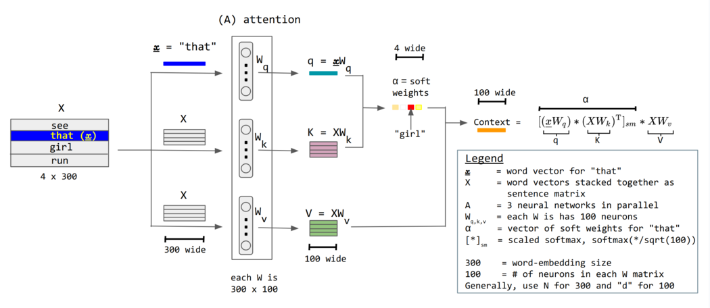

Self-Attention 机制是现代深度学习的重要突破，它通过 Query-Key-Value 三元组计算，彻底解决了传统 RNN/LSTM 在处理序列数据时面临的**并行计算瓶颈**和**长距离信息损失**问题。本文将深入剖析其核心原理、多头注意力设计以及位置编码技术。

> 内容基于李宏毅老师机器学习课程 [^1][^2]，结合最新技术发展整理

<!--more-->

## 不同种类的输入输出

当输入是个向量序列 - sequence 时，我们有些策略对输入进行处理。

对于文字输入，最简单的办法，是 one-hot 编码，每个词对应一个位置。对于比较长的段落，我们或许要创建一个长度等于世间所有词的向量，然后每个位置与词一一对应。除了尺寸非常大之外，这种方法并不能携带任何语义信息。

后来我们发展出了 embedding 技术，略去细节不表，我们可以得到一些向量代表词语，但这些词是具有语义关系的。语义相近的词在向量空间中同样接近，并且支持在语义上进行加减组合。

对于语音输入，我们通常用向量描述一小段 - 25ms 声音，再移动这个窗口 - 10ms 继续采样，所以 1s 的语音，会被写成 100 维的向量。

对于输出，可能有三种情况。其一，每个输入的 vector 对应一个 label，input 和 output 的 length 是相同的。通常场景为词性标注。其二，一个序列 sequence 对应一个 label，比如商品评价的情感分析，会议录音的发言者辨识等。其三，序列对应序列，不知道有多少 label，我们无法在事先知晓模型的输出长度。常见场景为翻译，模型要自己通过一些技术决定何时结束输出。

对于 sequence to sequence 任务，传统的全连接神经网络，也是可以考虑上下文的。可以把向量进行上下文拼接，手动为当前输入提供一定范围的上下文信息。当需要整个 sequence 作为上下文时，设置一个巨大的 window 并进行拼接，变得很难实现。

从技术发展的时间顺序来说，为了解决序列输入，从上下文向量拼接，发展出了 RNN，接着是 LSTM 和 GRU。为了进一步解决循环模型必须要按顺序输入和计算的问题，才有了接下来的 self attention 和 transformer。

## Self Attention

RNN 及其变体 LSTM 等通过按照序列顺序输入并保存 hidden state 的方式，试图保留与当前输入距离较远的信息。RNN 的权重矩阵连乘造成的梯度消失和爆炸被 LSTM 的门与加法设计可以计算更远的梯度。

但需要按顺序输入逐个计算的效率问题，和长期信息损失的性能问题依然存在。LSTM 从本质上将，只是对 RNN 的 hidden state 的更新过程做了更精巧的设计。但从本质上将，这个 hidden state 依然是对过去信息的压缩，压缩就要有损失。对于 LSTM 来说，很多步以前的信息，能通过 forget gate 而保留信息当当前都是幸运，更别说这个过程中对于原始信息做了多少压缩。LSTM 并没有完全解决 RNN 的设计缺陷，只是稍微增强。而 self attention 对于结构的重新设计，是进步的关键。

具体来说，首先以向量级别的计算为例，想要计算 input $a_{1}$ 与 $a_{2}$ 的 attention score，首先要计算 $q_{1}=W_{q}a_{1}$，接着计算 $k_{2}=W_{k}a_{2}$。在得到 query 和 key 之后，计算两个向量间的 dot product 得到 $\alpha_{1,2}$，这就是我们想要的 attention score——$a_{1}$ 与 $a_{2}$ 之间相关性的度量。再得到 $\alpha_{1,1}, \ldots, \alpha_{1,i}$ 之后，还会通过一层激活函数——以 softmax 为例，计算对数归一化，得到 $\alpha'_{1,i}$。

得到了重要性的度量，下一步就是提取信息。首先为每个输入 $a_{i}$ 计算其对应向量值 $v_{i}=W_{v}a_{i}$，再利用前面算出的 attention score 对其进行加权和，得到输出向量 $b_{1}=\sum_{i}\alpha'_{1,i} v_{i}$。观察这个 $b_{1}$ 的构成，如果 attention score $\alpha'_{1,i}$ 大，那么对应的 $v_{i}$ 所携带的信息在输出 $b_{1}$ 中对应的比例就大。这个加权和的设计实现了信息按重要性的提取和整合。按照同样的流程，我们就可以得到更多的 $b_{i}$，这正是我们 self attention 的输出。

> 我们可以把这个过程想象成在图书馆查资料：**Query (Q)**：" 我想找关于深度学习的书 "。**Key (K)**："《神经网络入门》"、"《图解机器学习》"；**Value (V)**：这本书本身的内容。
>
> 自注意力就是用你的问题 (Q) 去和所有书的标签 (K) 对比，看看哪个标签跟你的问题最相关（计算 Attention Score）。然后，根据相关性得分，把最相关的那些书 (V) 的内容重点整合起来，形成最终答案。

以下是更一般更严谨的表示方法

*图片来源：[^3]*

不妨把输入 $a_{i}$ 当作行向量上下堆叠得到矩阵 $\mathbf{X}$，每行对应一个词向量——这就是把整个序列当成矩阵输入。如图中示例所示，$X$ 的尺寸为 $4 \times 300$，即 $T \times d_{\text{model}}$，其中 $T$ 为 token 数量——句子中多少词；$d_{\text{model}}$ 为 embedding 的输出维度。

对于 query $q_{1}=W_{q}a_{1}$ 就可以矩阵化为 $Q=XW_{q}$，其每个行向量对应 $q_{i}$。同样可以得到 $K=XW_{k}$, $V=XW_{v}$。其中 $W_{q},W_{k},W_{v}$ 的尺寸为 $d_{\text{model}} \times d_{k}$，其中 $d_{k}$ 就是想要的 query 和 key 的向量长度，二者长度应该相等，因为后面要进行 dot product。图片中的例子，$d_{k}=100$, $d_{\text{model}}=300$。

对于 attention score $A=QK^T$，其每一元素 $a_{i,j}$ 都对应 $q_{i}$ 与 $k_{j}$ 的 dot product，$A'$ 为 softmax 后的 attention matrix。$A$ 的尺寸为 $T \times T$，$a_{i,j}$ 代表了 token $i$ 对于 token $j$ 的 attention。注意这个 $A$ 并不是对称的。

最后输出 $O=A'V$，其中 $V$ 的维度 $T \times d_{v}$，每行就是 $b_{i}$ 对应 $\sum_{j} v_{j}\alpha'_{i,j}$，即按照 attention score 的信息加权和，输出尺寸为 $T \times d_{v}$。在标准 Transformer 架构中通常设定值向量的维度 $d_{v}$ 等于键向量的维度 $d_{k}$。因此，对于多头注意力，有 $d_{k}=d_{v}=\frac{d_{\text{model}}}{h}$；对于单头注意力 $h=1$，则有 $d_{k}=d_{v}=d_{\text{model}}$，此时输出维度 $T \times d_{v}$ 与输入维度 $T \times d_{\text{model}}$ 完全一致。"

> 在单头情况中 $d_{k}=d_{v}=d_{\text{model}}$。有些参考中，单头下会将 $d_{k}=d_{v}<d_{\text{model}}$，这是网络架构设计的不同思路。但无论如何，我们要使得输出矩阵 $O$（$T \times d_{v}$）在经过后续处理之后（例如多头拼接和线性层），最终变成与输入尺寸 $T \times d_{\text{model}}$ 一致。

纵观整个流程，只有权重矩阵 $W_{q},W_{k},W_{v}$ 需要在训练中估计，其余都是矩阵乘法计算。

通常我们使用 $\text{Attention}(Q,K,V)=\text{softmax}\left(\frac{QK^T}{\sqrt{d_{k}}}\right)V$，其中 $\sqrt{d_{k}}$ 是缩放因子，使得乘法的结果落在 softmax 的小梯度区域，更有利于收敛。

$\sqrt{d_{k}}$ 作为缩放因子当然不是凭空出现的。在没有其存在的时候，我们经常会发现训练过程中，梯度消失——训练误差都无法降低。更细节地说，当 $d_{k}$ 很大的时候，$q \cdot k = s$ 的结果方差会很大。对于一个方差很大的向量通过 softmax，这会使得一个分量十分接近 1，而其他分量都接近 0（结果向量十分接近 one-hot vector）。如果我们尝试计算注意力 $a_{i} = \text{softmax}(s)_{i} = \frac{e^{s_{i}}}{\sum_{k} e^{s_{k}}}$ 的损失函数梯度 $\frac{\partial L}{\partial s_{i}} = \frac{\partial L}{\partial a_{j}} \frac{\partial a_{j}}{\partial s_{i}}$，对于 $\frac{\partial a_{j}}{\partial s_{i}}$（即 softmax 函数的导数），通过雅克比矩阵不难推出

$$
\frac{ \partial a_{j} }{ \partial s_{i} } =
\begin{cases}
a_{i}(1-a_{i}) & \text{if } i=j \\
-a_{i}a_{j}   & \text{if } i \neq j
\end{cases}
$$

所以，无论是靠近 0 还是靠近 1 的 $a_{i}$ 都会使得梯度消失。为了避免这种情况，我们添加因子 $\frac{1}{\sqrt{d_{k}}}$ 来降低点积矩阵的方差，进而缓解其靠近 0 和 1 的现象，使其落到 softmax 函数中导数较大的区域，从而尽可能避免梯度消失，保证训练稳定。

$\text{softmax}\left(\frac{QK^T}{\sqrt{d_{k}}}\right)$ 每行对应了给定 token 的 attention 分布。最后输出的，是对于每个 token 的新的表示方式。

## 多头注意力

在利用 $q$ 和 $k$ 寻找相关性的时候，一个 $q_{i}$ 代表了某种相关性特征，实际中可能有多种指标用于衡量同一序列向量间的相关性。

我们只需要训练更多的 $q$，以 $a_{1}$ 为例。构造 $q_{11}$ 用来 query 一种相关性，$q_{12}$ 用来捕捉另一种相关性。对应的 $a_{2}$ 应该有 $k_{21}$ 用来与 $q_{11}$ 内积，$k_{22}$ 用来与 $q_{12}$ 进行内积。从矩阵表示上，$Q_{i}=XW_{Q}^{i}$，$K_{i}=XW_{K}^{i}$，$V_{i}=XW_{V}^{i}$，其中 $W_{Q}^{i}$、$W_{K}^{i}$、$W_{V}^{i}$ 的尺寸为 $d_{\text{model}} \times d_{k}$，$d_{k}=\frac{d_{\text{model}}}{h}$。

那么如单头情况，$\text{head}_{i}=\text{Attention}(Q_{i},K_{i},V_{i})=\text{softmax}\left(\frac{Q_{i}K_{i}^T}{\sqrt{d_{k}}}\right)V_{i}$，同样的 $\text{head}_{i}$ 的尺寸为 $T \times d_{k}$，把所有的 $\text{head}_{i}$ 左右拼接起来就得到新的序列表达 $\text{Concat}(\text{head}_{1},\text{head}_{2},\ldots)$，其尺寸为 $T \times d_{k} \times h = T \times d_{\text{model}}$，同输入保持相同尺寸。

如果输出的话，再接上一个线性层，其对应 weight $W_{O}$ 的尺寸为 $d_{\text{model}} \times d_{\text{model}}$。$\text{MultiHead}(Q,K,V)=\text{Concat}(\text{head}_{1},\text{head}_{2},\ldots)W_{O}$，尺寸依旧保持 $T \times d_{\text{model}}$。这个线性层的设计，可以把多个 head 进行结合，同时有利于进行解释。简单地将不同 $\text{head}$ 块左右堆叠，不同 head 对于序列的观察是相互割裂的，下一层网络可能无法充分地利用割裂的 head 信息。增加一个线性层，通过网络的学习，可以按照合适的权重把不同 head 的结果进行混合。这个线性层是多头注意力机制中不可缺少的重要部分。

多头注意力的有效性可以类比于一个专家小组会议。对于一个复杂问题（例如，理解一个句子的含义），我们不只咨询一位通用专家，而是同时咨询多位在不同领域（语法、语义、指代关系等）有专长的专家。每个 ' 头 '（head）就是一位专家，它从自己的专业角度审视输入序列，并给出一个 ' 意见 '（即一个注意力输出）。最后，通过一个线性层，我们将所有专家的意见进行加权汇总，形成一个更全面、更鲁棒的最终决策。这种方式允许模型在不同的表示子空间中并行地捕捉多种多样的依赖关系。

## 位置编码

让我们再总结一下 self attention 机制。通过 self attention 我们就可以得到与输入尺寸相同的矩阵，其中每个输出向量 $z_{i}=\sum_{j} \text{attention-score}_{i,j} \times v_{j}$ 都与输入向量 $x_{i}$ 对应，是所有输入向量的加权平均，权重主要为当前输入 $i$ 对于其他输入 $j$ 的注意力分数，由 $q_{i}$, $k_{j}$ 的 dot product 得到。无论其对应的输入向量 $i$, $j$ 距离多远，我们都会同样地计算他们之间的 attention，这是相对于循环神经网络按序列顺序计算的重大改进，但也忽略了可能携带重要信息的序列顺序，或者叫对应向量的位置信息。这就是位置编码想要解决的问题。

从思路上说，我们只要把前面输入 self attention 的 token 向量 $x_{i}$ 加上位置编码向量 $\text{PE}(\text{pos}_{i})$，$x_{i}' = x_{i} + \text{PE}(\text{pos}_{i})$ 再进行 self attention 的训练和计算。

主要讨论的问题就是，如何进行 position encoding？最简单的，在原始论文中提出的方法是利用三角函数，对于序列中第 $pos$ 位置的词，其位置编码 PE 对应第 $i$ 个维度的数值通过

$$
\begin{aligned}
PE_{pos,2i}=\sin\left(\frac{pos}{10000^{2i/d_{\text{model}}}} \right)\\
PE_{pos,2i+1}=\cos\left(\frac{pos}{10000^{2i/d_{\text{model}}}} \right)
\end{aligned}
$$

计算，其中 $pos$ 是词元在序列中的位置，$i$ 是词向量中的维度索引（从 0 到 $\frac{d_{\text{model}}}{2}-1$），$d_{\text{model}}$ 是 embedding 的总维度。通过这种方式，奇数位置用 cos，偶数位置用 sin，这样每个位置都会有一个独一无二的、维度为 $d_{\text{model}}$ 的位置编码向量。

> 位置编码的具体技术还在不断发展，新的方法层出不穷。上面的方法只是原始论文 Transformer 中提出的一种方法。

## 截断自注意力

Self-Attention 的核心优势在于其并行计算能力和对长距离依赖的直接建模。与
RNN/LSTM 必须按顺序处理、导致计算时间复杂度为 $O(n \cdot d^{2})$ 且信息在序列中传递的最大路径长度为 $O(n)$ 不同，Self-Attention 允许一次性计算所有 token 之间的依赖关系。虽然 self-attention 整体计算复杂度为 $O(n^{2} \cdot d)$（其中 $n$ 是序列长度，$d$ 是表示维度），高于 RNN，但其计算可以被高度并行化。

更重要的是，任意两个位置之间的信息交互路径长度为 $O(1)$，这从根本上解决了 RNN 的长距离依赖问题和梯度消失问题。得益于现代 GPU 的并行计算能力，Self-Attention 在处理长序列时往往比顺序执行的 RNN 更快。

当然，天下没有免费的午餐。Self-Attention 的计算复杂度为 $O(n^{2} \cdot d)$（其中 $n$ 是序列长度，$d$ 是表示维度），当序列非常长时，这个平方项带来的计算和内存开销是巨大的。这就是 " 截断自注意力 "（Truncated Self-Attention）或稀疏注意力（Sparse Attention）等变体想要解决的问题。

在计算 attention 的时候，我们可以不对序列中的所有向量进行计算，而是只计算当前向量附近一部分范围。这就可以控制注意力矩阵的复杂度。至于到底在什么范围内进行截断，要根据不同的业务和实际场景进行判断。

## Self-Attention VS CNN

CNN 更多用在图像问题上。一张图片我们也可以看作是个向量序列。每个向量长度为 3 对应 3 channel，序列长度正是整个图片的长 x 高。如果按照 self attention 的方法进行计算，我们会考虑所有像素块之间的相关性，模型会自行决定哪些像素需要共同考虑。而 CNN 则是会把关注点放在固定范围的感受野当中。有文章 [^5] 可以证明，Self-Attention 在一定的条件限制下，可以等价于 CNN，即 CNN 是个 Self-Attention 的特例。

从模型复杂度上来说，Self-Attention 比 CNN 更加灵活。就跟所有的复杂 vs 简单模型一样，在数据量较少的情况下，CNN 可能会有更好的表现；而数据量大起来之后，Self-Attention 可能会有更好的表现。这一趋势在近年来得到了验证，最典型的例子就是 Vision Transformer (ViT) 的出现。

ViT 将图像分割成一个个小块（patches），将这些图像块序列化后，像处理文本一样输入到标准的 Transformer 编码器中。实验证明，在超大规模数据集上预训练时，ViT 的性能可以超越顶尖的 CNN 模型，这标志着 Self-Attention 机制作为一种**通用的特征提取器**，其应用已成功从自然语言处理扩展到了计算机视觉领域。

## 参考文献

[^1]: 李宏毅. (2021). 机器学习 2021 - Self-attention. *YouTube*. <https://www.youtube.com/watch?v=hYdO9CscNes>

[^2]: 李宏毅. (2021). 机器学习 2021 - Transformer. *YouTube*. <https://www.youtube.com/watch?v=gmsMY5kc-zw>

[^3]: Wikipedia Contributors. (2024). Attention (machine learning). *Wikipedia*. <https://en.wikipedia.org/wiki/Attention_(machine_learning)>

[^5]: Cordonnier, J.-B., Loukas, A., & Jaggi, M. (2020). On the Relationship between Self-attention and Convolutional Layers. *International Conference on Learning Representations (ICLR)*.
