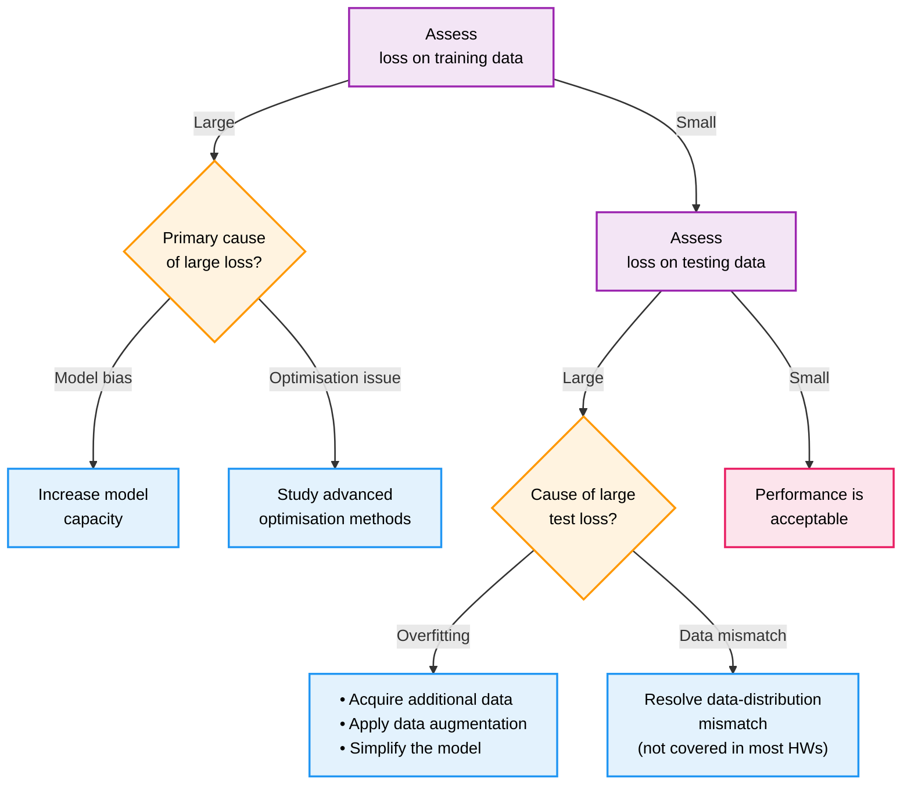

这是 Hylee 机器学习的第二堂课，主要是介绍如何提高 kaggle 作业分数，即通过各种常用方式提高模型结果准确率。

<!--more-->

从训练集上的误差表现开始，如果训练集的误差表现不错，测试集上的误差表现也不错，我们就可以宣告成功！但大多数情况，训练不会如此轻易结束。

当训练集的误差表现不好的时候，有两个方向可以考虑：模型偏误和优化问题。

模型偏误，也就是模型的 flexibility 不够，提供的潜在结果集中根本就不包含误差足够小的结果。改进方法就是增加模型的 flexibility，可以通过改用更复杂的方法、增加更多的 feature 等，重新设计拟合更强力的模型。

优化问题，指的是，其实我们的候选结果中，拥有还算不错的情况，但我们无法求解得到它。这可能是由于它陷在了局部最小值，而无法收敛。这可能涉及到优化器的选择、学习率的设置等方面。

如何判断到底问题的类型？可以先从简单模型开始，逐步提高复杂度。加入模型 A 比较简单，而模型 B 稍加复杂，那么 B 在优化得当的情况下，一定是要比 A 的训练误差小的。如果 B 的训练误差大于 A，就可以确定是优化的问题。所以，我们可以从较小、参数设置较简单、容易收敛的小模型入手，得到训练误差的基准之后，逐步增加模型的复杂度，同时调整优化求解的各种设置。

当训练集的误差表现还算不错的时候，我们才开始观察测试误差。测试误差表现较差，同样可能来自两大问题，过拟合和数据分布不匹配。

判定过拟合的标准是，训练误差很低，但是在没见过的测试集上的表现很差。可以形象地理解为，模型记住了训练集的数据，甚至连其中的误差都完全记住了，在没见过的测试集数据上，就是随便猜测结果，自然误差很大。

最简单的抑制过拟合的方法，就是增加数据。想办法去搜集更多数据，或者利用数据增强技术去生成更多合理的数据参与训练，可以有效地解决。但不是所有的情形都可以增加数据。过拟合的本质，可以认为是模型的 flexibility 太高，导致记住了很多噪声而忽略了真正的 pattern。限制 flexibility 的方法有：减少参数、共享参数、减少 feature、Early Stopping、Regulation、Dropout 等。但，flexibility 自然不是越低越好，太低就又变回了上面我们所讨论的 model bias，这是个 "Bias - Complexity trade-off"。**什么是合适的 flexibility，要根据不同业务决定。**

> 高弹性 vs 低弹性的一个例子是，fully-connected 的神经网络模型 vs CNN。

分布不匹配，这其实是个数据的问题，不算是训练的问题。我们可以用，在训练数据集上得到的模型用在测试数据集上，的潜在前提是，测试数据和训练数据来自同一分布，而不是来自不同分布。课堂上的例子是，新冠数据的死亡人数预测。假设我们用 2020 年的数据进行训练，而想要在 2021 年的数据上进行预测和验证，那么无论我们如何在训练集上努力，测试集上的结果都不会太好。因为从数据分布上来讲，2020 年和 2021 年是完全不一样的。
