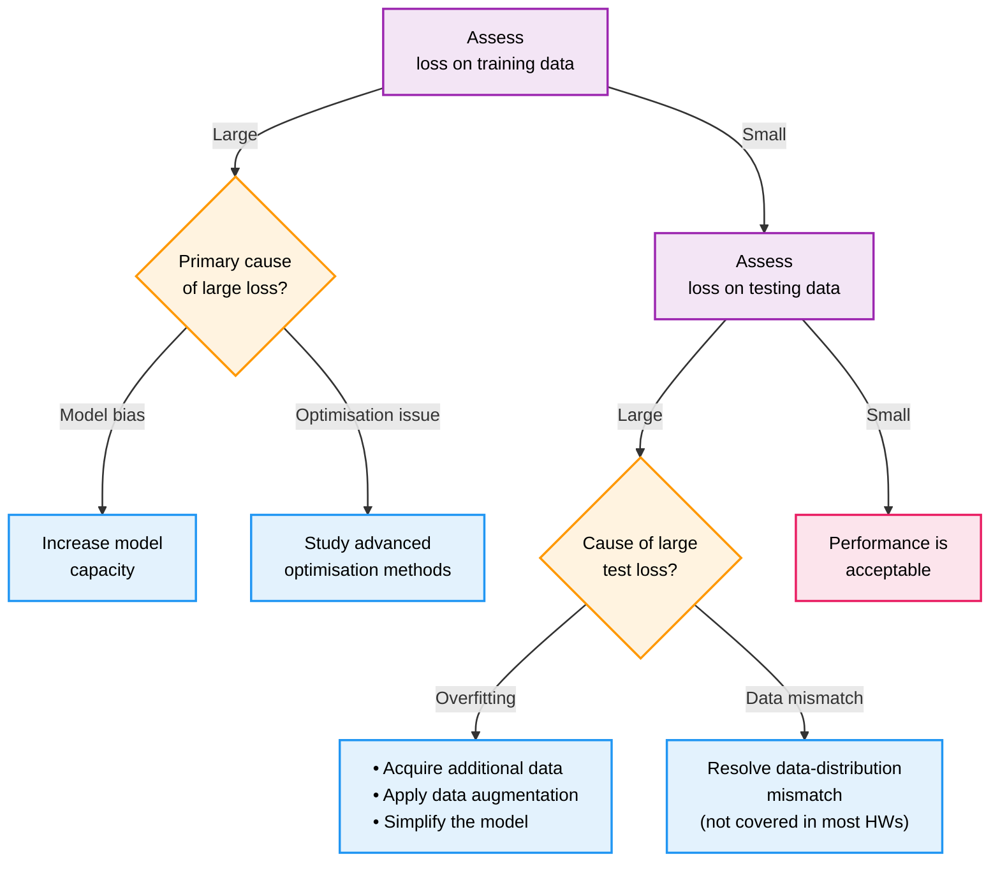

这是 Hylee 机器学习课程的第二讲，重点介绍机器学习模型优化的通用指导原则。本文将系统性地讲解如何通过分析训练误差和测试误差，识别模型问题的根本原因，并提供相应的解决策略来提升模型性能。

<!--more-->

## 概述

在机器学习项目中，理想情况下训练集误差和测试集误差都很小，这意味着模型成功地学习了数据中的模式并能够很好地泛化到新数据。然而，实际情况往往更加复杂，需要我们系统性地分析和解决各种问题。

本文用 " 训练误差→测试误差 " 两步排查流程，教初学者判断模型性能不佳的根本原因（模型偏差、优化问题、过拟合或数据分布不匹配），并给出针对性的改进策略。

## 机器学习模型诊断流程

当训练集的误差表现不好的时候，有两个方向可以考虑：模型偏误和优化问题。

模型偏误 (bias) 常见于模型容量不足，也就是模型的 capacity 不够，提供的潜在结果集中根本就不包含误差足够小的结果；于此同时也会产生过大方差 (variance)。本文聚焦在 "capacity-error"，先忽略方差带来的噪声。改进方法就是增加模型的 capacity，可以通过改用更复杂的方法、增加更多的 feature 等，重新设计拟合更强力的模型。

> 模型容不足 - 高偏差，低方差；模型容量过大 - 低偏差，高方差，过拟合风险

优化问题指的是，其实我们的候选结果中，拥有还算不错的情况，但我们无法求解得到它。这可能是由于它陷在了局部最小值，而无法收敛。这可能涉及到优化器的选择、学习率的设置等方面。

如何判断到底问题的类型？可以先从简单模型开始，逐步提高复杂度。假如模型 A 比较简单，而模型 B 稍加复杂，那么 B 在优化得当的情况下，一定是要比 A 的训练误差小的。如果**在相同训练轮数和优化超参数**的前提下， B 的训练误差大于 A，就可以怀疑是优化不充分。我们可以从较小、参数设置较简单、容易收敛的小模型入手，得到训练误差的基准之后，逐步增加模型的复杂度，同时调整优化求解的各种设置。

> 实际上优化中的更常见问题是陷在鞍点

当训练集的误差表现还算不错的时候，我们才开始观察测试误差。测试误差表现较差，同样可能来自两大问题，过拟合和数据分布不匹配。

判定过拟合的标准是，训练误差很低，但是在没见过的测试集上的表现很差。可以形象地理解为，模型记住了训练集的数据，甚至连其中的误差都完全记住了，在没见过的测试集数据上，就是随便猜测结果，自然误差很大。

最简单的抑制过拟合的方法，就是增加数据。想办法去搜集更多数据，或者利用数据增强技术去生成更多合理的数据参与训练，可以有效地解决。

但不是所有的情形都允许增加数据。过拟合的本质，可以认为是模型的 flexibility 太高，导致记住了很多噪声而忽略了真正的 pattern。限制 capacity 的方法有：减少参数、共享参数、减少 feature、Early Stopping、Dropout 但容量自然不是越低越好，太低就又变回了上面我们所讨论的 model bias，这是个 "Bias - Complexity trade-off"。**什么是合适的 flexibility，要根据不同业务决定。**

> 高弹性 vs 低弹性的一个例子是，fully-connected 的神经网络模型 vs CNN。

分布不匹配，这其实是个数据的问题，不算是训练的问题。我们可以用，在训练数据集上得到的模型用在测试数据集上的潜在前提是，测试数据和训练数据来自同一分布，而不是来自不同分布。

课堂上的例子是，新冠数据的死亡人数预测。假设我们用 2020 年的数据进行训练，而想要在 2021 年的数据上进行预测和验证，那么无论我们如何在训练集上努力，测试集上的结果都不会太好。因为从数据分布上来讲，2020 年和 2021 年是完全不一样的。
