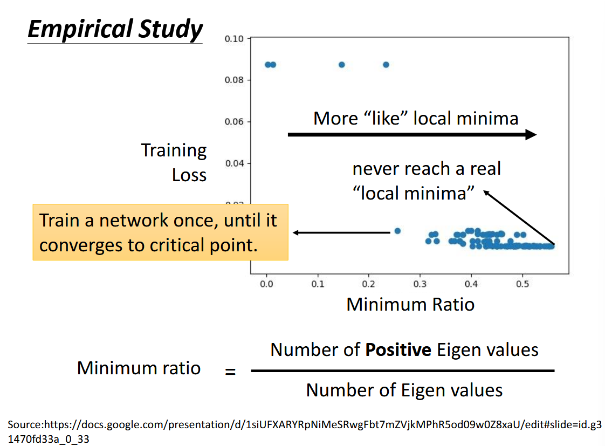
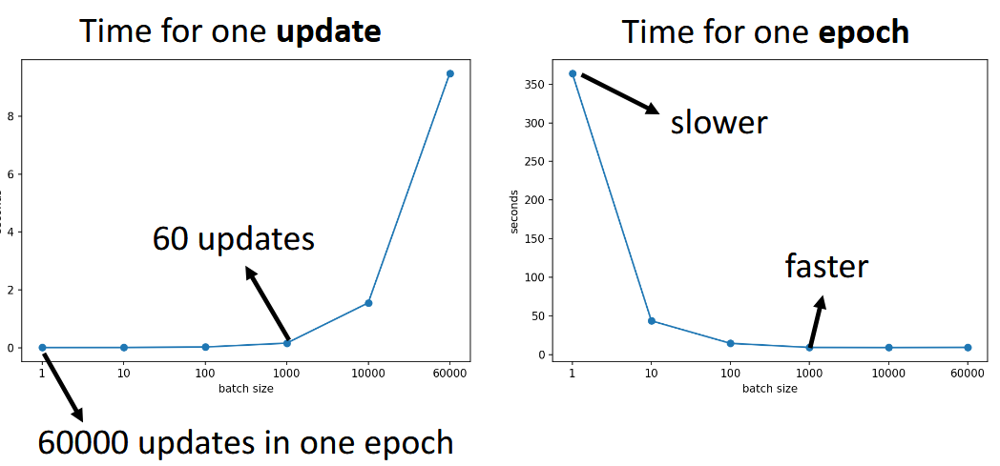
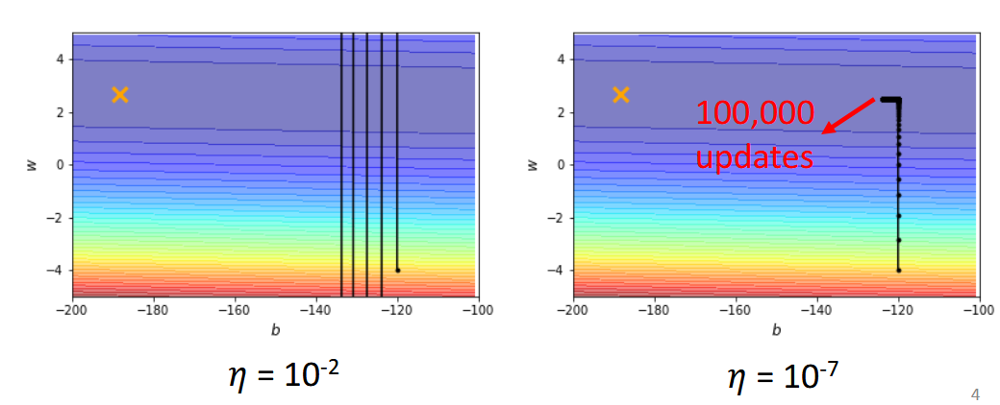
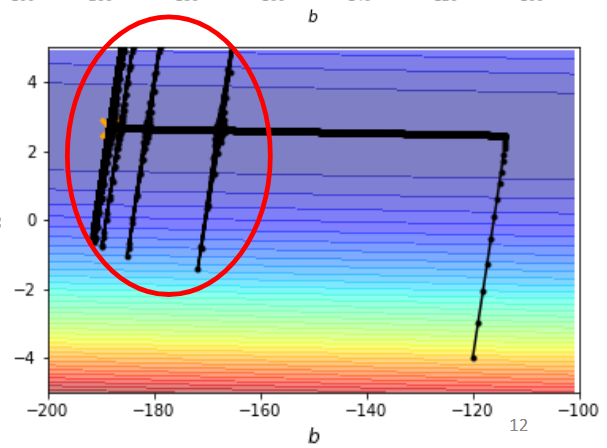

本文是李宏毅机器学习 2021 课程系列的第三篇，汇总了三个重要视频的核心内容：梯度消失时的 Critical Point 分析、Batch 和 Momentum 训练技巧，以及自适应学习率方法。文章深入解析了训练过程中遇到的优化难题，特别是当 loss 停止下降时的真实原因分析，并提供了包括小批量训练、动量优化、AdaGrad、RMSProp 和 Adam 等实用解决方案。通过理论分析和实验证据，帮助读者理解现代深度学习优化器的设计原理和使用技巧。

<!--more-->

这是这个系列的第三篇博客，主要包含视频 [When Gradient Is Small: Local Minimum and Saddle Point](https://www.youtube.com/watch?v=QW6uINn7uGk), [Tips for Training: Batch and Momentum](https://www.youtube.com/watch?v=zzbr1h9sF54) 以及 [Tips for Training: Adaptive Learning Rate](https://www.youtube.com/watch?v=HYUXEeh3kwY) 的汇总和自我扩展。

## Critical Point - Local Minimun and Saddle Point

> 参考[^1]

当我们训练模型的时候，很容易观察到 loss 不再下降，这意味着我们的模型训练遇到了一些问题。通常会听说，这是因为 gradient descent 的弊端，因为它很容易卡在 local minima 而无法找到更优的参数。

但其实这种说法十分地外行。首先，优化不止可能卡在 local minina，而是可能卡在任何梯度为 0 的地方，除了 local minima，还有 saddle point - 鞍点。我们把优化过程中任何梯度为 0 的点都叫作 critical point。其次，在后面会有实验证明，卡在 local minima 的可能性远小于卡在 saddle point；我们在实践中观察到的 loss 无法继续下降的原因，很大可能不是 critical point，而是不合适的 learning rate 带来的结果。

当梯度真的到达 0 的时候，也不是完全没有办法。如果是 saddle point，还是有办法**逃离**的。我们首先要想办法区分 saddle point 和 local minima。

当损失函数 $L(\theta)$ 在 $\theta=\theta'$ 时，我们可以通过泰勒公式在点 $\theta'$ 进行展开

$$
L(\theta) \approx L(\theta')+(\theta-\theta')^Tg + \frac{1}{2}(\theta-\theta')H(\theta-\theta')
$$

其中，$g$ 为梯度向量，还写作 $\nabla L(\theta')$, $g_{i}=\frac{ \partial L(\theta') }{ \partial \theta_{i} }$; $H$ 是 Hessian 矩阵，$H_{ij}=\frac{ \partial^{2} }{ \partial \theta_{i} \partial\theta_{j}}L(\theta')$

当到达 critical point 的时候，$g=0$, $L(\theta) \approx L(\theta') + \frac{1}{2}(\theta-\theta')H(\theta-\theta')$，可以看出点 $\theta'$ 的情况取决于 $(\theta-\theta')H(\theta-\theta')$ 的正负符号。

不妨令 $(\theta-\theta')H(\theta-\theta')=v^THv$，对于所有的 $v$

- $v^THv>0$，那么 $L(\theta)>L(\theta')$，故 $\theta'$ 为 local minima
- $v^THv<0$，那么 $L(\theta)<L(\theta')$，故 $\theta'$ 为 local maxima
- $v^THv$ 有正也有负，那么 $\theta'$ 为 saddle point

在计算中，我们无需算出所有 $v$ 的对应情况，只需要计算 Hassian 矩阵的对应特征值和特征向量。当 $\lambda$ 为特征值，$\mu$ 为对应特征向量时，我们有 $\mu'H\mu=\mu'\lambda \mu=\lambda \lVert \mu^{2} \rVert <0$, 当 $\lambda<0$ 时，自然对应 $L(\theta) \approx L(\theta')+ \frac{1}{2}\mu ^T H\mu \to L(\theta)<L(\theta')$,其中 $\theta-\theta'=\mu, \theta=\mu+\theta'$。故**只要向对应特征向量 $\mu$ 的方向继续更新参数，就可以逃离 saddle point 并实现降低 loss。**

> PPT[^1] 上有个实际计算的简单示例，演示了具体计算过程。

从感性角度理解，local minima 是要求当前点对于周围任何方向都最小，当我们的参数空间足够大，error surface 的维度足够高的时候，**local minima 是很难出现的**。下图更是从实验上证明，最坏的情况也有一半的特征值是负的，也就是有一半的方向，是可以让参数走过去以降低 loss 的。

如果你真的认为训练是因为 critical point 卡住，那也是卡在了 saddle point，然后就可以美滋滋地逃离。实践中因为上述的特征向量计算复杂，通常采用其他方法。

## Batch

batch 的主要思路，就是把 train data 分块，每次参数更新只考虑一个 batch，而不是全部的 train data，当我们遍历了全部的 batch，也就是更新参数 $\frac{\text{train data size}}{\text{batch size}}$ 次之后，叫作一个 epoch。通常我们会 shuffle - 重新把 batch 分组，而后继续下一个 epoch。

让我们想象两个极端情况，$\text{batch size}=n$ 和 $\text{batch size=1}$ ，即 model 每次看到全部的数据再更新参数以及看到一个样本就着急地更新参数。对于前者，他需要看到所有样本，所以每个 batch 的计算时间比较长，一个 epoch 只需要更新一次参数；对于后者，他每次看到一个样本就更新一次参数，每个 batch 的计算时间较短，但一个 epoch 需要更新更多次参数。可以理解为，当 batch 较大的时候，它可以看到更多的数据，每次更新参数都比较精准；当 batch size 比较小的时候，更新的步伐看起来比较 noisy。

从直觉上，我们会认为当 batch size 比较大的时候，由于数据更多，计算 gradient 的数据量更大，计算 gradient 的时间会很长，但实际上，由于我们可以利用 GPU 提供的并行计算 - parallel computing，同时计算许多 gradient，而不是直觉上的一个接着一个。在计算 gradient 中，batch size 从 1 到 1000，参与训练数据量的变动对于每次更新 - every update 的影响是可以忽略不计的，除非 batch size 达到突破了 GPU 限制。

> 每见过一个 batch，然后更新参数 - update；见过所有 batch，即见过全部训练数据 - epoch

batch size 越小，需要进行的 update 和其他操作就更多，每个 epoch 所需要的时间就越多。一次 update 所需时间 vs batch size 与 一次 epoch 所需时间 vs batch size 是相反方向的关系，所以 batch size 的大小是个关于 trade-off 的超参数。具体细节见摘自 PPT[^1] 的下图：

从实际训练中来看，batch size 越小，在 train 和 validation 上表现越好。这是因为，小 batch size 会对应更多的 loss function，不同的 error surface 可能对应不同的 critical point， 这就很难在训练中卡在某个 critical point，同时 small batch 中的 noisy 在验证和测试的过程中会提高模型的泛化能力，从而在全方位获得更好的表现。

> small batch size 可以帮助逃离 critical point

完全相同的模型，采用不同的 batch size，把 full 和 small 在训练集上的表现 train 到同样好，测试时发现，small batch size 的结果会更好。

> 实践中会更加复杂，在调整 batch size 的同时，需要对应比例调整 learning rate [^2]。

最后用来自 PPT 上的对比表格进行总结

|                                      | Small      | Large               |
| ------------------------------------ | ---------- | ------------------- |
| Speed for one update (no parallel)   | Faster     | Slower              |
| Speed for one update (with parallel) | Same       | Same(not too large) |
| Time for one epoch                   | Slower     | **Faster**          |
| Gradient                             | Noisy      | Stable              |
| Optimization                         | **Better** | Worse               |
| Generalization                       | **Better** | Worse               |

> 注：batch size 不是越小越好，噪声太大，也可能让模型无法真正利用训练数据，反而损害泛化效果

当然，大 batch size 并不是一无是处，它能更大程度加快训练速度，在优化得当的情况下，是可以获得与较小 batch size 相同的泛化能力和测试结果，同时又可以节省 CPU/GPU 资源，节约时间。

## Momentum

momentum - 动量是解决优化问题的另一个技巧，借鉴了物理中的思路，当一个球体从陡峭高处向下滑动时，即使遇到了局部低点，仍然也会有力尝试把球体带离低点。传统的梯度下降就好像不断地找更低的方向让球从高处滚下，当梯度为 0 时，就好像球滚到了低谷，利用动量的思想，给出综合梯度下降之前的移动方向，即使梯度为 0 时也可以给出一个新的方向，以逃离低点。

传统的梯度下降，就是从 $\theta^{0}$ 开始，计算 $g^{0}$，更新 $\theta^{1}=\theta^{0}- \eta g^{0}$；继续计算 $g^{1}$，更新 $\theta^{2}=\theta^{1}-\eta g^{1}$。。。

考虑动量，就是在传统梯度下降的基础上，考虑前一步的 movement。具体来说，从 $\theta^{0}$ 开始，令 $m^{0}=0$，计算梯度 $g^{0}$，紧接着更新 $m^{1}=\lambda m^{0}-\eta g^{0}$，让我们更新参数 $\theta^{1}=\theta^{0}+m^{1}$；计算梯度 $g^{1}$，$m^{2}=\lambda m^{1}-\eta g^{1}$，更新参数 $\theta^{2}=\theta^{1}+m^{2}$。

> movement - $m^{t}$ 不光有仅梯度 $g^{t}$ 决定，还需要考虑前一步的 movement - $m^{i-1}$。

进一步推导观察我们可以得到 $m^{0}=0, m^{1}=-\eta g^{0}, m^{2}=-\lambda \eta g^{0}-\eta g^{1}$，**movement - $m^{t}$ 是之前所有梯度 $g^{0},\dots,g^{t-1}$ 的加权和。**

## Adaptive Learning Rate

> 参考[^3]

当我们发现 train loss 卡住不再下降的时候，我们会联想到梯度为 0 和 critical point，可如果我们仔细审查一下此时的梯度，会惊奇地发现，梯度不但显著不为零，甚至还会有所波动。可能此时，我们的参数正在局部最小值左右疯狂震荡，却无法接近；可能正在小步奔向局部最小值而永远无法达到。这是我们即将要讨论的学习率 - learning rate 的问题。

学习率决定了在确定梯度下降的方向之后，我们的参数更新迈出多大步伐。如果过大，可能会从一个高 loss 走向令一个高 loss，如果过小，可能在梯度同样很小的时候，怎么也走不到终点。可以参考摘自 PPT^[^3] 中的示例图。

不同的参数需要不同的学习率。从直观上可以想象，两个变量的天然尺度就不同，某些参数的梯度天然很大，而某些天然很小，如果将二者设置为完全相同的学习率，就会导致大的那个不断震荡，而小的几乎不收敛。

> 关于为什么不同参数需要不同学习率，可以解释的方向还有很多。

当我们考虑参数 $\theta_{i}$ 的更新 $\theta_{i}^{t+1} = \theta^t_{i}-\eta g_{i}^{t}$，其中 $g_{i}^{t}=\frac{ \partial L }{ \partial \theta_{i} }|_{\theta=\theta^t}$，可以考虑添加 parameter dependent 项，更新参数通过

$$
\theta_{i}^{t+1} = \theta^t_{i}-\frac{\eta}{\sigma_{i}^{t}} g_{i}^{t}
$$

关于$\sigma_{i}^{t}$的具体计算方法，Root Mean Square 是一种经典思路。 $\theta^{1}=\theta^0-\frac{\eta}{\sigma^0}g^0$ , $\sigma^0 = \sqrt{ (g^0)^{2} }=\lvert g^0 \rvert$; $\theta^2=\theta^1-\frac{\eta}{\sigma^1}g^1$,$\sigma^{1}=\sqrt{ \frac{1}{2} [(g^0)^{2}+(g^1)^{2}] }$，更一般

$$
\theta^{t+1}=\theta^t-\frac{\eta}{\sigma^{t}}g^t, \sigma^t=\sqrt{ \frac{1}{t+1} [(g^0)^{2} + (g^1)^{2}+\dots+(g^t)^{2}] }=\sqrt{ \frac{1}{t+1} \sum_{i=o}^{t}(g^t)^{2} }
$$

> 省略为了区分单个参数$i$的下标，参数$\theta_{i}^{t}$简化为$\theta^{t}$

可以看到，$\sigma^t$与过往梯度$g$在大小上成正比，那么$\frac{\eta}{\sigma^t}$就与过往梯度成反比，即当过往梯度较大的时候，调整小一点的 lr，当过往梯度较小的时候，调整大一点的 lr。这个思路，就是经典的 AdaGrad。

AdaGrad 有个问题，就是它将过往的所有梯度都纳入考量并给予相同权重，这是不太合理的。因为我们可能已经从梯度大走向梯度小，而 lr 的调整系数还在考虑过往的巨大梯度而不能及时缩小 lr。所以，后来提出了 RMSProp，作为目前被广泛使用的基础组件。

同样利用$\theta_{i}^{t+1} = \theta^t_{i}-\frac{\eta}{\sigma_{i}^{t}} g_{i}^{t}$更新参数，只不过

$$
\sigma^t = \sqrt{ \alpha(\sigma^{t-1})^{2}+(1-\alpha)(g^t)^{2} }
$$

其中$0<\alpha<1$，通常对最近的梯度$g^t$赋予较大参数，对过往梯度$\sigma^{t-1}$使用较小权重。因为放大了最近梯度的权重，所以 RSMProp 的反应速度要快上许多，对于较小梯度可以较快的加大 lr，对较大梯度同理。**实践中经常使用的 Adam 就是 RMSProp + Momentum。**

要注意，RMSProp 解决的是 **"各参数维度（per-parameter）步长如何因梯度大小不同而自动缩放"** ，让大梯度对应维度补步长变小，小梯度对应维度步长变大。但它并没有解决，**"整条训练曲线在时间维度上该走多快、何时减速"**，RMSProp 只是提供基于绝对步长$\eta$的相对步长$\frac{\eta}{\sigma^{t}}$，如何规划绝对步长随训练过程的变化，这是 learning rate schedule 的课题。

通常在训练前期，我们可能需要比较大的 lr 以快速降低 loss，而在快要结束的时候，error surface 接近平坦，需要较小的 lr 来寻找局部最小。这就需要我们根据训练的不同时期，对学习率进行整体上的大小调节。

下图^[3]演示了只使用 AdaGrad 可能产生的问题。在训练初期纵轴方向梯度较大的时候，步长较小，逐渐找到了梯度较小的区域，开始向左边的最优点进行移动。此时纵轴方向的梯度变小，$\sigma^t$是过去所有梯度的加权，慢慢也随之变小，不断积累之后导致$\frac{\eta}{\sigma^t}$变大，会向纵轴方向大步前进。好在还可以修正，因为向纵轴向前进很快就遇到了梯度较大的地方，$\sigma^t$随之变大，$\frac{\eta}{\sigma^t}$随之变小，训练曲线又回到了原来的路径。这个过程可能会循环几次，然后慢慢走到终点。

对于上述这种情况，我们只需要设置 learning rate decay，让 learning rate 随着训练进行不断减小即可解决。

learning rate 随着时间变化，有很多种方式。另一种十分常见的方式，就是 warm up。在开始的阶段使用小一点的 lr 然后不断升高，在某个时刻之后再下降，其中，变到多大、速度如何都是超参数。对于 warm up 的必要性，感性的解释就是，由于我们需要计算$\sigma$，而$\sigma$的计算需要很多数据加权，所以一开始先设置小一点的 lr，帮助搜集足够的数据来形成合适的$\sigma$，等其比较准确之后，再慢慢爬升学习率。

> 还有诸如余弦衰减等方式

## 总结

我们从原始的梯度下降，进化到了

$$
\theta_{i}^{t+1} = \theta_{i}^{t} - \frac{\eta_{t}}{\sigma_{i}^{t}} m_{i}^{t}
$$

其中，$\eta_{t}$是 learning rate schedule，$m_{i}^t$是动量，不同于原始梯度下降只考虑梯度方向，而是将过去所有的梯度方向做加权平均得到新的更新方向。步伐大小为$\frac{m_{i}^t}{\sigma_{i}^t}$，其中$\sigma_{i}^t$是过往梯度的 RMS，只提供数值，而方向由$m_{i}^t$提供。在实践中，使用 Adam + learning schedule 技术即可实现。各种不同的方法，不过是在变化 $m_{i}^t$，$\eta_{i}^t$，和$\eta_{t}$的计算方式。

## Reference

[^1]: <https://speech.ee.ntu.edu.tw/~hylee/ml/ml2021-course-data/small-gradient-v7.pdf>
[^2]: <https://stackoverflow.com/a/53046624>
[^3]: <https://speech.ee.ntu.edu.tw/~hylee/ml/ml2021-course-data/optimizer_v4.pdf>
