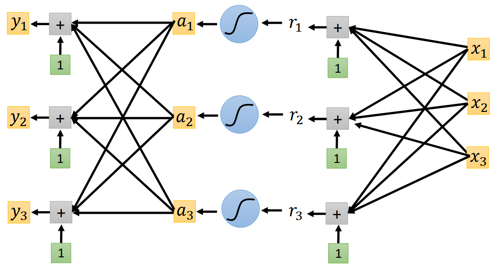
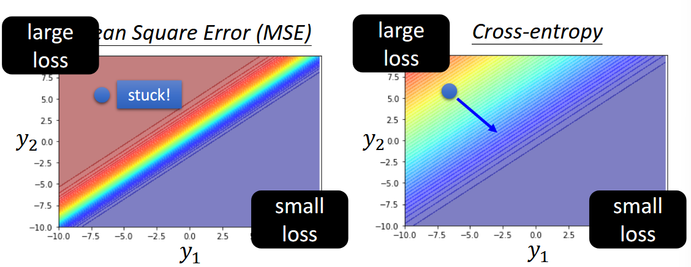
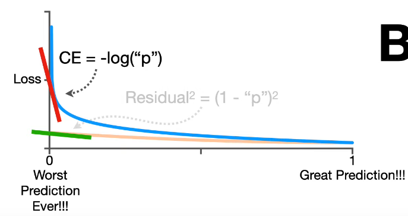

本文是李宏毅机器学习2021系列课程的第四篇。在分类任务中，简单地把类别编号为 1、2、3 会暗含距离和顺序偏差。为避免这一问题，我们首先使用 one-hot 向量对离散标签做无序编码。随后，网络输出层通过 softmax 将 logits 映射为 0-1 之间且和为 1 的概率分布；真正的 one-hot 只是标签而非模型输出。为了衡量输出概率与真实标签的差距，交叉熵损失因其在“错误但自信”的区域梯度更大，相比均方误差（MSE）更易于优化。本文结合公式推导与误差面可视化，说明从编码、输出到损失函数的完整链条如何共同提升分类模型的训练效率与性能。

<!--more-->

## one-hot vector

one-hot vector 最主要解决的是，分类变量不需要排序的问题。假设我们有三个分类变量，分别赋值为 1,2,3。此时，对于模型输出来说，类别 1 相比类别 3 更接近类别 2，这实际上引入了排序和距离。这种情况在实际问题中，是不一定成立的。

> 同时参数矩阵和梯度计算也很方便

但要注意，不是所有的分类变量都需要严格变成 one-hot。首先，如果他们真的是有序的，或者他们只是标识符而不参与计算和输出，或者在类别极其多的时候，one-hot 会特别稀疏。

## 分类问题的神经网络模型

在计算中，假设我们有三个特征 $x_{i}$，想要输出结果为 3x1 的 one-hot vector，计算过程与常规神经网络无异，只是输出为 3x1 的向量，其中 $y_{i}$ 代表可能是类别 $i$。具体架构见下图:[^1]

在回归中，我们有 $y=b+c^T\sigma(b+Wx)$，其中 $\sigma$ 为激活函数，常为 sigmoid $y=\frac{1}{1+e^{-x}}$ 或者 RELU。在分类问题中类似，同样 $y=\mathbf{b'}+W'\sigma(\mathbf{b}+W\mathbf{x})$ 得到一个其分量可能为任意数值的向量。softmax 会把任意实数向量映射到 (0, 1) 区间，并保证所有分量之和为 1，因而可视为 " 类别概率分布 "。

> 注意真正的 one-hot 只是标签形式，模型输出通常是接近 one-hot 的概率向量。

我们再衡量模型输出的 $\mathbf{y'}$ 与其对应 label $\hat{y}$ 之间的距离与损失。其中，$\text{softmax}$ 中

$$
y_{i}'=\frac{\exp(y_{i})}{\sum_{j} \exp(y_{i}) }
$$

上式 $0<y_{i}'<1$, $\sum_{i=1}y_{i}^{'}=1$， $y$ 是 softmax 前的 logits，$y'$ 为 softmax 后的概率向量，$\hat{y}$ 为 one-hot label。

softmax 是做指数再归一化，从最终输出的数值上可以观察，它可以将大的值和小的值之间的差距放大。多个类别时需要使用 softmax 层进行归一化，而只有两个类别的时候，sigmoid 就是 softmax 的二维情况，可以验证二者在数学推导上完全等价。

> 回归问题中的激活函数多用在隐藏层从而近似任意曲线，而输出层多采用直接输出。这与回归问题中的情形，有所不同。

为了优化，我们需要定义输出 $\mathbf{y}'$ 与 label $\hat{\mathbf{y}}$ 之间损失和误差。定义损失函数 $L=\frac{1}{N}\sum_{n}e_{n}$，其中误差 $e$ 在回归中，可以是 MSE - $e=\sum_{i}(y_{i} - y_{i}^{'})^{2}$ 作为标签与模型输出之间的距离度量。在分类问题中，当然 MSE 也是可行的。但更常用的是最小化交叉熵损失 $e=-\sum_{i}y_{i}\ln y_{i}^{'}$，本质上就是最大似然 - maximize likelihood。

PPT[^1] 上的一个三分类的例子例子是说，当我们固定 $y_{3}$，观察不同 $y_{1},y_{2}$ 所构成的 error surface，cross entropy 与 MSE 有下区别：

从左上角到右下角的优化过程中，MSE 的 error surface 左上角是极其平坦的，这就给优化带来了难题。反观 cross entropy，左上角的梯度变化很大，这很有利于优化。

从下图也可以得到类似结论 [^2]，cross entropy 在 worst case 附近的斜率很大，而 MSE 却很小。

从 MSE 到 cross entropy 中，我们可以得出结论， **改变损失函数可以降低优化的难度**。

所以什么交叉熵更易优化？

- 在 "错误但自信"的 worst-case 区域，交叉熵梯度大 → 指引明显。
- MSE 在同一区域梯度趋近 0 → 容易卡在平坦高原。
- 因此切换损失函数可以显著改善收敛速度与最终性能。

## Reference

[^1]: <https://speech.ee.ntu.edu.tw/~hylee/ml/ml2021-course-data/classification_v2.pdf>
[^2]: <https://www.youtube.com/watch?v=6ArSys5qHAU>
