本笔记基于 Hylee 2021 机器学习与深度学习课程第一讲，系统梳理了机器学习三步走（模型假设、损失函数、参数优化）、模型改进思路、激活函数（sigmoid、ReLU）、深度学习结构与反向传播算法等核心知识，结合案例帮助读者高效构建深度学习的理论基础与实践认知。

<!--more-->

机器学习，就是找一个函数，给定输入，得到我们想要的输出。

机器学习的主要任务，回归、分类，是两大主要问题；还有结构学习 structured learning- 画图、写文章等，让机器学会创造。

AlphaGO 也是个分类问题，不过是从 19x19 的结果中选择。

## 机器学习三步走

机器如何找到这个函数？课上的例子，是利用 youtube 上过去的观看信息等资料，预测明天的频道观看次数。这个过程可以总结为三个步骤。

1 先猜测一下，函数什么样子。关于昨天观看次数 $x_{1}$ 的一元线性 model - $y=b+wx_{1}$？其中 $b,w$ 是未知的，$x_{1}$ 是已知的，叫做特征 feature，$w,b$ 分别为 weight 和 bias。 这个猜测，通常来自于对这个特定问题领域的知识的了解 - based on domain konwledge。

2 定义 loss(is a function of parameters, $L(b,w)$)，输出代表着这组参数的好坏。从 training data 中计算，在这个问题中，就是频道过去的观看次数，$e=|y-\hat{y}|$，其中 $y$ 就是 labal - 正确的值。$L=\frac{1}{N}\sum e_{n}$，$L$ 越大代表着参数越差，有 MAE - mean absolute error 和 MSE 等。如果 $y$ 和 $\hat{y}$ 都是概率分布的话，$L$ 可能选择使用 Cross entropy - 交叉熵。 这里展示了一个 loss 的等等高线图 - error surface。

3 最佳化 optimization, 数学表示$w^{opt}, b^{opt} = \arg\min_{w,b} L$。 这门课，唯一用到的方法就是梯度下降 - _gradient descent_。 以一元情况为例，随机选择初始值 $w^0$，然后计算在点的梯度/偏导数/微分 $\frac{\partial L}{\partial w} \bigg|_{w=w^0}$。果梯度是负数，增加参数值；梯度是正数则降低参数值；其实就是看左右，哪一边比较低，向低的方向迈一步。

这一步的大小 $\eta \times \frac{\partial L}{\partial w} \bigg|_{w=w^0}$ 取决于斜率/微分和学习率 $\eta$ (larning rate)，是个超参数 hyperparameters(自己设定的，决定参数的更新效率)。

$$
w^{1} = w^0 - \eta \frac{\partial L}{\partial w} \bigg|_{w=w^0}
$$

接着反复进行移动的操作，找到 $w^T$。停止的时间，可能是由参数训练次数上限 - 超参数，也可能是找到微分为 0 的情况，也就是不再移动。

这就引出了，梯度下降方法的局限，就是会被损失的局部最小值困住，而找不到全局的最小值。

> 这个局限，在实际中是个假问题，只是个理论上的东西。真正的痛点，晚些再讨论。

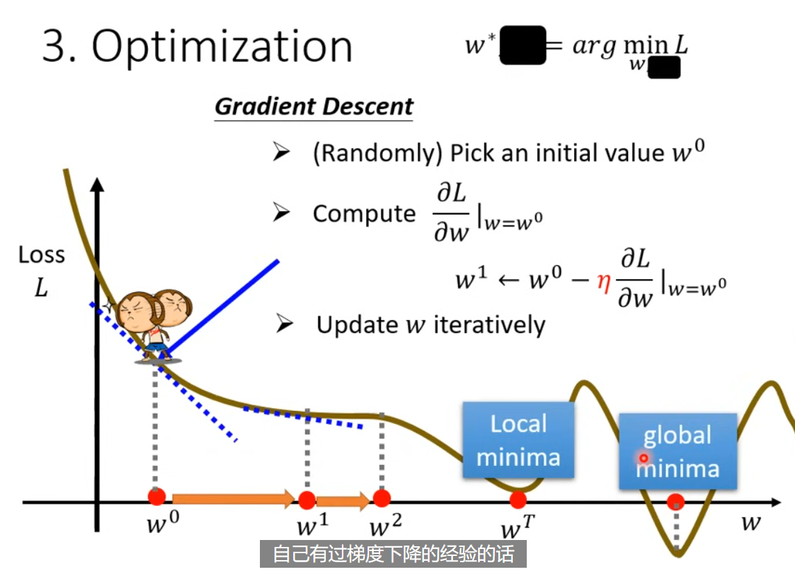

可以自然的，从一个参数推广到多参数。

微分计算的具体细节，都被大部分框架包装好了。你可以完全不知道，微分在干什么！

以上三个步骤合起来，叫做训练。在没看过的数据上，再进行预测和计算误差。

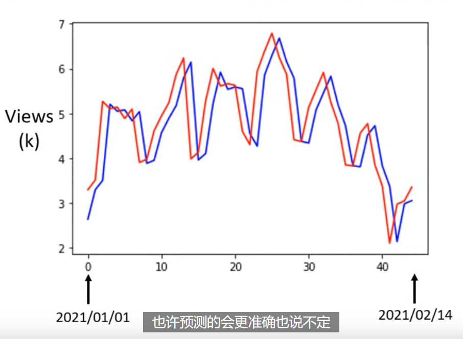

可以看到，预测值 - 蓝色 其实只是把真实值往后移动一天而已。而真实值 - 红色 是有周期性的，周五和周六都是比较低的。在观察到周期性之后，我们的线性 model 是很差的，因为只能参考前一天。所以应该修改一下模型形式，而这个修改，应该来自我们对问题的理解。考虑新模型 $y=b+\sum^7_{j=1}w_{j}x_{j}$ ，计算后发现，训练 loss 降低了，在测试 loss 上也略有降低。如果再尝试考虑 28 天的信息，训练和测试误差都更会变好一点。

## 流程改进

线性模型的问题是，$x,y$ 之间的线性关系，对于现实世界来说，过于简单了。这种来自 model 的限制，叫做 model bias（与 $b$ 的那个 bias 不一样）

Piecewise Linear Curves - 对于线性回归的改进，把曲线分解为常数 + 一些列 sigmod。

如果是曲线形状，是一样可以化为近似折线情形的。它可以拟合，任意连续曲线。

上面的蓝色曲线，用 sigmoid 曲线进行逼近，$y=c \frac{1}{1+e^{-(b+wx_{1})}}=c\times sigmoid(b+wx_{1})$，蓝色的曲线，一般可以叫做 hard sigmoid。不同的 sigmoid 形状，就是由不同程度 $c,w,b$ 构成。

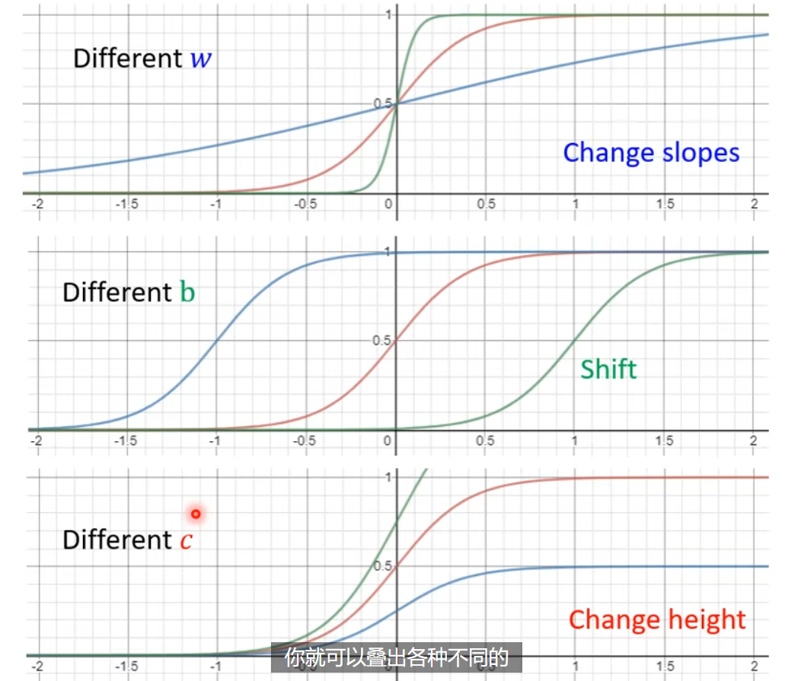

新的一元函数可以形如 $y=b+\sum c_{i}\times sigmoid(b_{i}+w_{i}x_{1})$。多元函数的具体见下图：

> sigmoid 的数量是可以自定义的，这是另一个超参数。sigmoid 数量越多，就越能拟合复杂的情形。

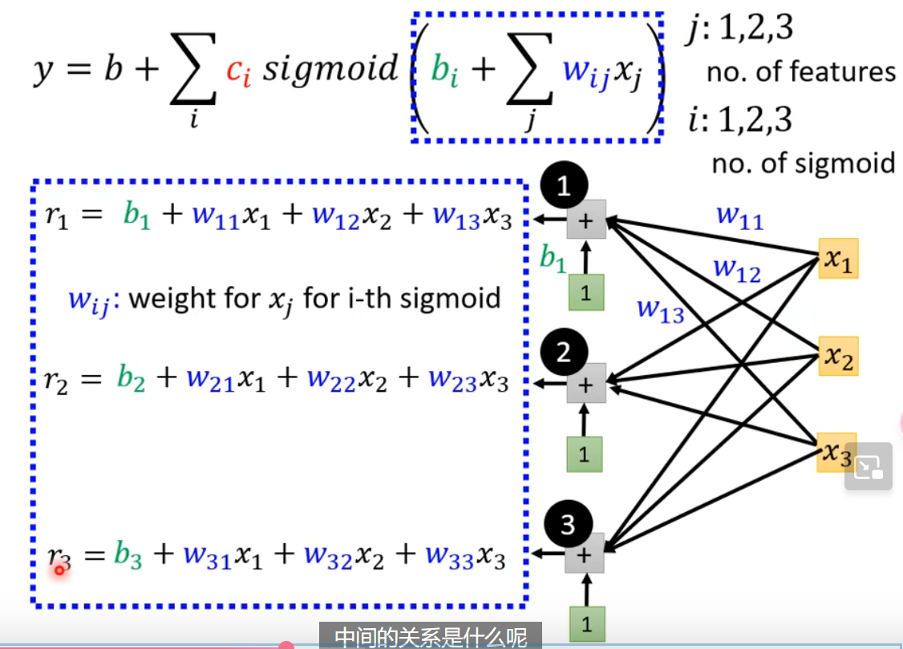

进一步利用向量乘法，$\mathbf{r}=\mathbf{b}+W\mathbf{x}$，$\mathbf{a}=\sigma(\mathbf{r})$，其中 $a_{1}=sigmoid(r_{1})$，$y=b+\mathbf{c}^T\mathbf{a}$，具体见下图

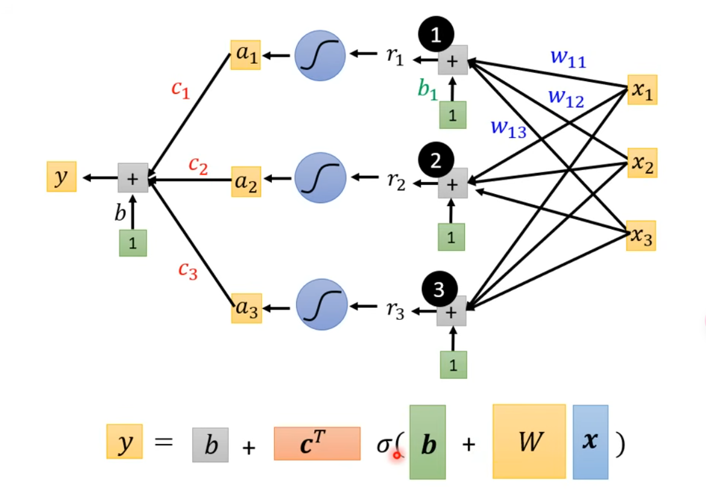

注意，此时我们就把机器学习三步走中的第一步，定义带有未知数的函数形式，变成了上图的形式。模型还有更多的变形，比如把 sigmoid 换成 RuLU - Rectified Linear Unit - $c\times \max(0, b+wx_{1})$，两个 ReLU 就可以合成一个上面所说的 hard sigmoid。sigmoid 和 ReLU 叫做 activation function。

> 后来我们都用了 ReLU，为什么 ReLU 更好，见更后面的课程。

改进之后的 Loss $L(\theta)$，本质上没有什么变化。引入一个新的参数 $\theta$，其代表了所有的需要估计的参数。

改进后的 optimization 也与之前没什么区别，方法还是梯度下降找最下损失。梯度的表示方法见下图，本质上就是所有参数 $\theta$ 对 $L$ 的偏导数，构成了一个向量。

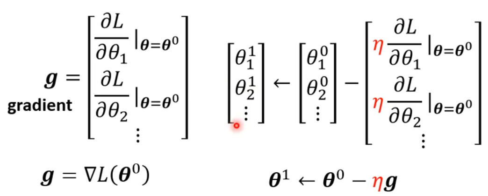

实际上，我们很难找到梯度为 0 的时候。具体代码下的更新方法，见下图。下图引出了 update 和 epoch 的区别。我们是把所有的数据分成不同的 batch（具体多少个取决于 batch size，也是个超参数），每次取一个 batch 计算 loss 和梯度，并更新 $\theta$。当见过所有的 batch 并更新参数之后，叫做一个 epoch。

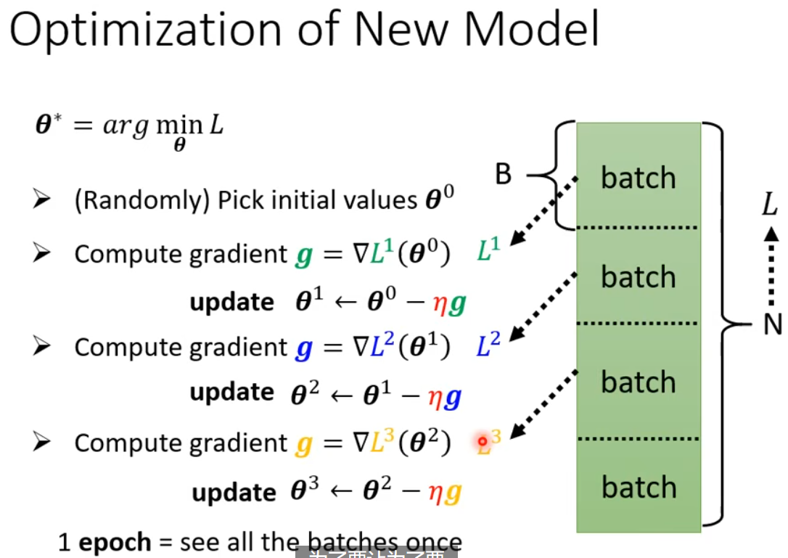

我们可以继续，套更多层的激活函数，到底嵌套多少层，这也是个超参数。

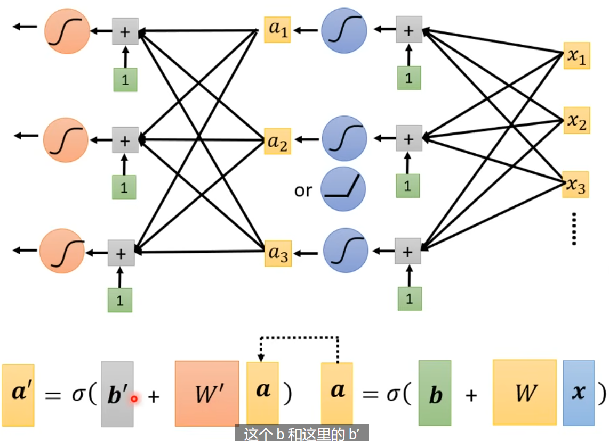

## 深度学习

上面我们改进后的模型，就是神经网络 - 此时每个部分叫做神经元。由于神经网络名声臭掉，人们该把他们叫做隐藏层，整个重新起名字叫 - 深度学习！

当后来，AlexNet, VGG, GoogleNet, Residual Net 把层数越做越多，这样一个问题就浮出水面。我们已经知道，足够多的 （横向排列的）sigmoid 就可以拟合任意函数，那我们为什么还要把他的层数越做越多，越做越深呢？且听后来分解。

课上利用实际的例子，发现在 4 层的时候，虽然训练 loss 有所降低，但是 test loss 反而比 3 层有所增加，这就引入了 overfitting 的概念。

## Backpropagation

神经网络结构下，因为有海量的参数，梯度的维度是非常大的。 backpropagation 就是高效计算梯度的方法。

链式法则的复习见下图：

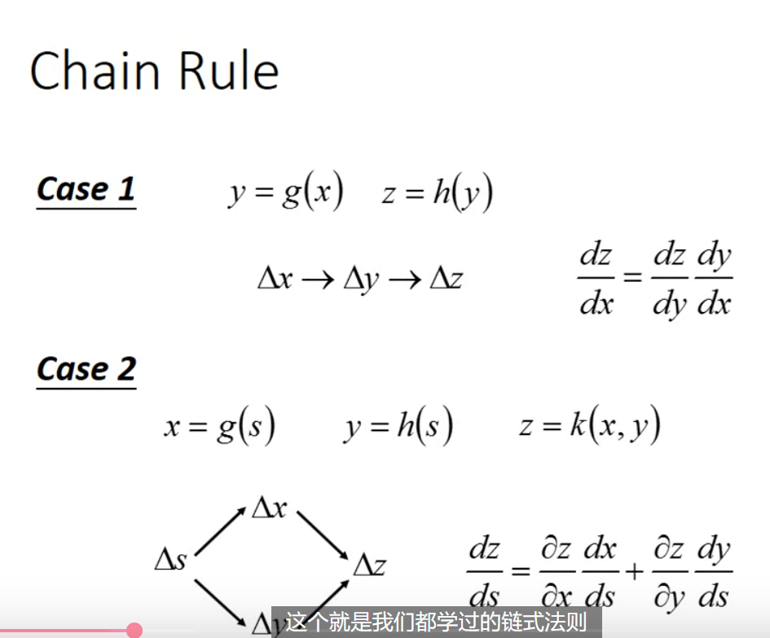

如果用 $C^n$ 表示 $y^n$ 与 $\hat{y}^n$ 之间的误差，那么 $L(\theta)=\sum_{n=1}^{N} C^n(\theta)$，通过链式法则进而有 $\frac{ \partial L(\theta) }{ \partial w }=\sum_{n=1}^{N} \frac{ \partial C^n(\theta) }{ \partial w }$。

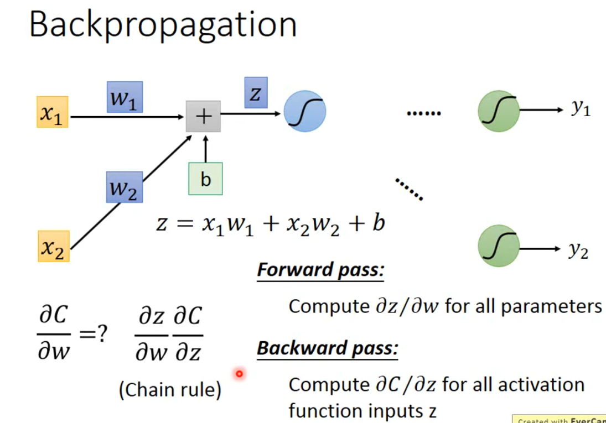

其中 $\frac{ \partial z }{ \partial w_{1} }=x_{1}, \frac{ \partial z }{ \partial w_{2} }=x_{2}$，其结果就是 $x$，计算起来是十分容易的，是我们对应 $w$ 的输入，所以 forward pass 是简单和容易理解的，具体有下图。

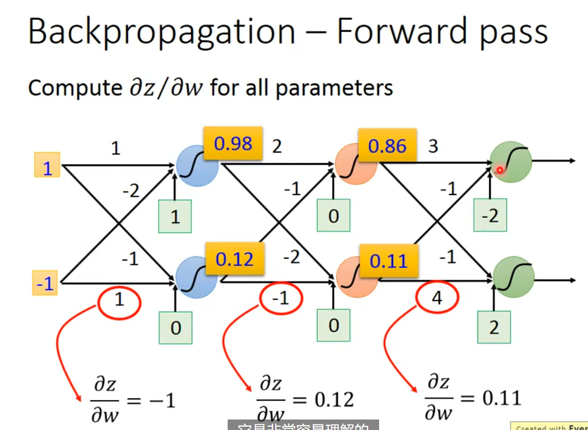

到了 backward pass $\frac{ \partial C }{ \partial z }$，问题就变得有些复杂。同样可以根据链式法则，进行拆分得到 $\frac{ \partial C }{ \partial z }=\frac{ \partial a }{ \partial z }\frac{ \partial C }{ \partial a }$。同时，$a=\sigma(z), \frac{ \partial a }{ \partial z }=\sigma'(z)$。问题就简化为如何计算 $\frac{ \partial C }{ \partial a }$。通过看图，发现 z 是通过 $z',z''$ 和后续一系列对 $C$ 进行影响（这里假定只有两项，其实不一定）。**不妨假设 $\frac{ \partial C }{ \partial z' }, \frac{ \partial C }{ \partial z'' }$ 已知**，那么 $\frac{ \partial C }{ \partial a }=\frac{ \partial z' }{ \partial a }\frac{ \partial C }{ \partial z'} + \frac{ \partial z'' }{ \partial a }\frac{ \partial C }{ \partial z'' }=w_{3}\frac{ \partial C }{ \partial z' }+w_{4}\frac{ \partial C }{ \partial z'' }$。故 $\frac{ \partial C }{ \partial z }=\sigma'(z)[w_{3}\frac{ \partial C }{ \partial z' }+w_{4}\frac{ \partial C }{ \partial z'' }]$

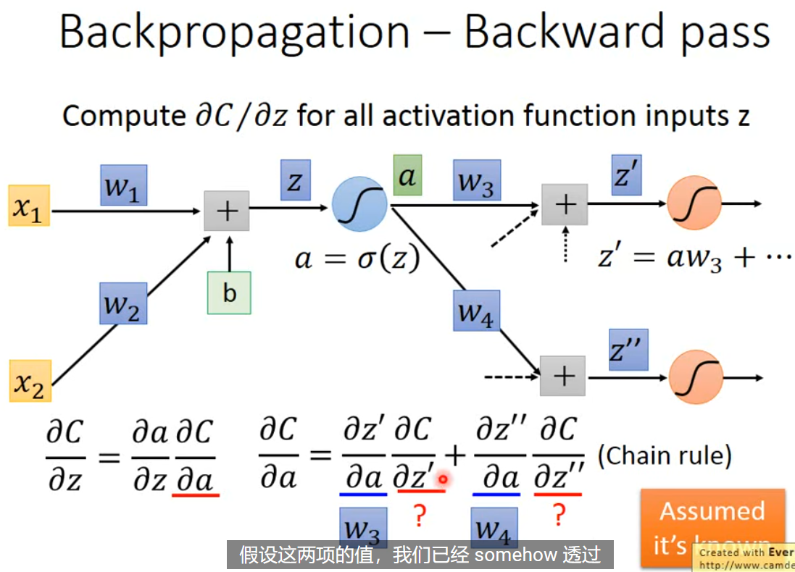

我们可以吧 backward pass 看作是一个反向传播的神经网络，其中 $\frac{ \partial C }{ \partial z'}, \frac{ \partial C }{ \partial z''}$ 已知，乘上 $w$ 再通过 $\sigma'(z)$。这里注意，$\sigma'(z)$ 是个常数，因为 $z$ 已经在前向传播中，计算得到。故这个神经元其实就是个常数乘法放大因子。所有的问题，到这里就剩如何计算 $\frac{ \partial C }{ \partial z'}, \frac{ \partial C }{ \partial z''}$。

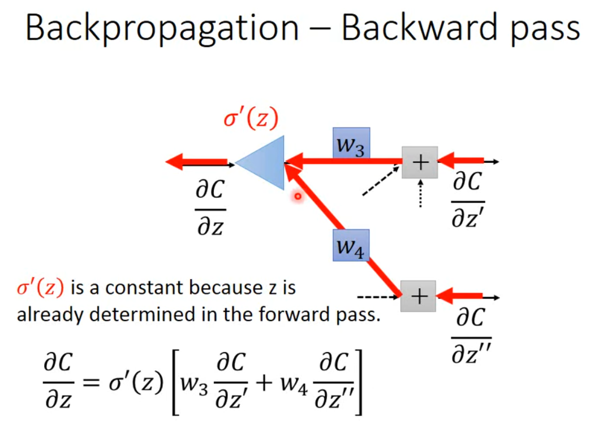

不妨假设，$z', z''$ 通过激活函数之后，已经输出了结果 $y_{1},y_{2}$。那么此时，计算 $\frac{ \partial C }{ \partial z' }=\frac{ \partial y }{ \partial z' }\frac{ \partial C }{ \partial y_{1} }$ 就变得可能，其中 $\frac{ \partial y }{ \partial z' }$ 取决于激活函数，$\frac{ \partial C }{ \partial y_{1} }$ 取决于误差形式的设定，这也是可以简单计算得到的，$\frac{ \partial C }{ \partial z'' }$ 同理。那么只要我们从后向前，真的从 $y_{1},y_{2}$ 对应的 $\frac{ \partial C }{ \partial z_{i}}$ 开始计算，再逐步往前传播，如下图。想象是从后向前算的一个新的神经网络，其中激活函数是 $\sigma'(z)$ 为常数。这样就可以计算得到我们想要的任意位置的 $\frac{ \partial C }{ \partial z }$。这就是 backward pass。

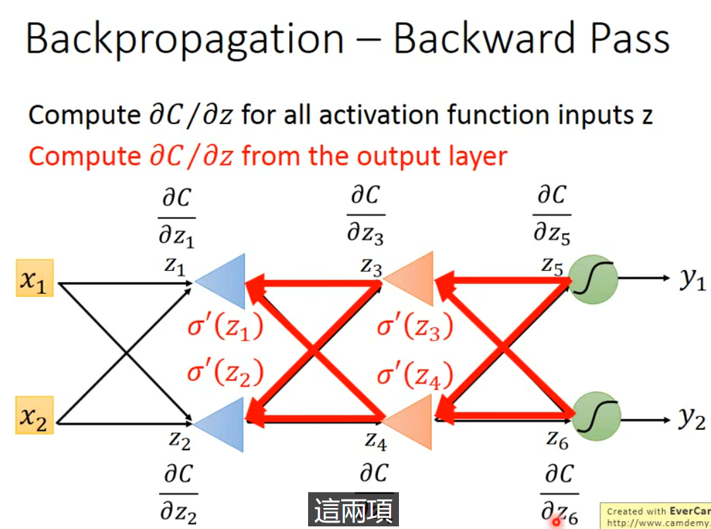

总结一下，当我们想计算损失函数对权重的偏微分 $\frac{ \partial C }{ \partial w }$ 用于梯度下降更新，就可以先 forwa pass 计算任意位置的 $\frac{ \partial z_{i} }{ \partial w_{i} }$，然后再反向计算一遍任意位置的 $\frac{ \partial C }{ \partial z_{i} }$，这样就可以通过链式法则得到 $\frac{ \partial C }{ \partial w }=\frac{ \partial z_{i} }{ \partial w_{i} }\frac{ \partial C }{ \partial z_{i} }$，这就是 backpropagation。

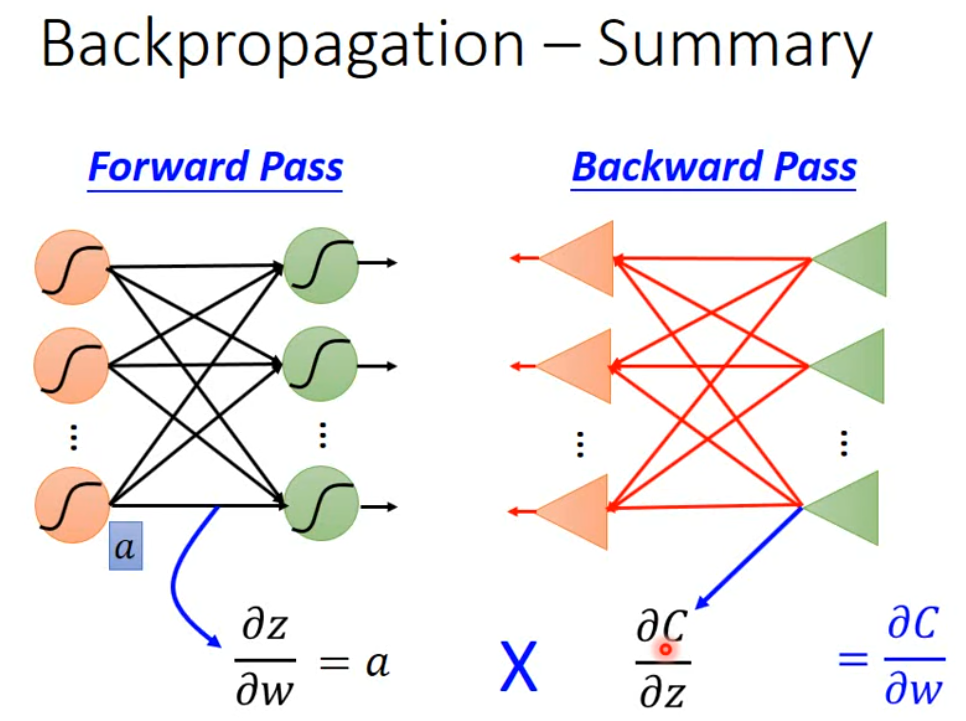

## Reference

<https://www.youtube.com/watch?v=Ye018rCVvOo&list=PLJV_el3uVTsMhtt7_Y6sgTHGHp1Vb2P2J>

<https://www.youtube.com/watch?v=bHcJCp2Fyxs&list=PLJV_el3uVTsMhtt7_Y6sgTHGHp1Vb2P2J&index=2>

<https://www.youtube.com/watch?v=ibJpTrp5mcE>
